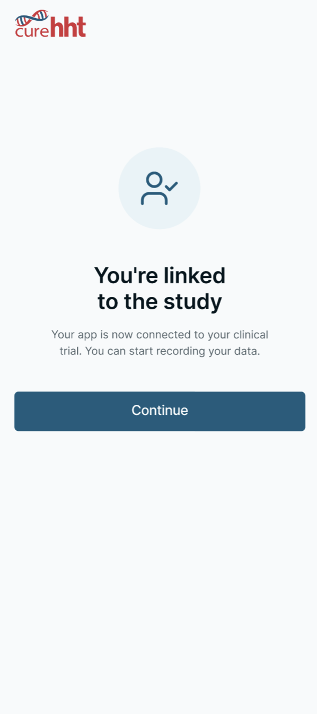

# Device Linking

The *Participant*-side linking flow comprises the platform-level rules for error handling and rate limiting on linking-code entry, the **Join the Study** screen the *Participant* uses to enter a code and consent to the **Clinical Trial Privacy Policy**, and the **Successful Linking Confirmation** that completes the transition from **User** to **Participant**.

## DIARY-PRD-linking-code-entry-errors: Linking Code Entry Error Handling

**Level**: PRD | **Status**: Draft | **Implements**: -
**Refines**: DIARY-BASE-participant-lifecycle

### Overview

Security best practices require generic error messages that do not reveal whether a *Linking Code* exists, is expired, or has been used. This prevents malicious actors from enumerating valid codes or determining code status. Rate limiting protects against brute-force attacks while a configurable cooldown balances security with usability.

Linking Code Validation Failure
: Any unsuccessful attempt to enter a linking code, regardless of the specific reason for failure.

Rate Limit Threshold
: The configurable maximum number of consecutive **Linking Code Validation Failures** permitted within a single rate limit window before further attempts are temporarily blocked.

Rate Limit Cooldown
: The configurable duration after which the rate limit counter resets and the **User** may attempt linking again.

Rate Limit
: The mechanism that caps repeated failed attempts within a window, governed by the **Rate Limit Threshold** and **Rate Limit Cooldown**.

### Assertions

**Error Messaging**

A. When a **Linking Code Validation Failure** occurs, the System SHALL display a single generic error message regardless of the specific reason for failure.

B. The error message SHALL NOT reveal the specific reason for failure.

C. When a **Linking Code Validation Failure** occurs, the System SHALL provide guidance to contact the *Site* for a new code.

**Rate Limiting**

D. When the number of consecutive **Linking Code Validation Failures** reaches the **Rate Limit Threshold**, the System SHALL block further linking attempts and display the **Rate Limit** error message until the **Rate Limit Cooldown** has elapsed.

E. The **Rate Limit Cooldown** SHALL be calculated from the first failed attempt in the current window.

**Configuration**

F. The System SHALL support *Sponsor*-configurable **Rate Limit Threshold** per study.

G. The System SHALL support *Sponsor*-configurable **Rate Limit Cooldown** per study.

H. The System SHALL support *Sponsor*-configurable error message text per study.

### Rationale

Linking codes are short, human-typeable secrets that confer access to a clinical-*Trial* *Participant* identity; the platform's threat model has to assume that someone may attempt to guess or enumerate valid codes. Two mitigations compose: a generic error message that does not distinguish "code does not exist" from "code expired" from "code already used" (assertions A and B — distinguishing them would tell an attacker exactly which guesses are worth pursuing), and a *Rate Limit* that caps the number of attempts in a window. The *Site*-contact guidance (assertion C) is the legitimate-*User* recovery path that survives the genericity rule — a real *Participant* who has mistyped their code gets the same message as an enumerator, but they also get the actionable next step (contact the *Site*). The cooldown anchored at the first failed attempt in the window (assertion E) prevents the trivial workaround of attempting just below the threshold, waiting one second, and continuing — the window is a fixed time interval from the first miss. *Sponsor*-configurable threshold, cooldown, and text let each deployment tune the security/usability trade-off and customize the message.

*End* *Linking Code Entry Error Handling* | **Hash**: dc87b4cf

## DIARY-GUI-join-study-screen: Join the Study Screen

**Level**: GUI | **Status**: Draft | **Implements**: -
**Refines**: DIARY-PRD-linking-code-entry-errors

### Overview

The **Join the Study** screen is presented to the *User* when initiating the linking workflow. It captures the **Mobile Linking Code** and the *Participant*'s explicit consent to the **Clinical Trial Privacy Policy** before any link is established.

Linking Consent
: The explicit acknowledgement by the Participant that they have read and consent to the Clinical Trial Privacy Policy. This consent must be captured before the linking code submission is permitted.

### Assertions

A. The **Join the Study** screen SHALL display a **Mobile Linking Code** entry field formatted according to the configured code format.

B. The screen SHALL display a **Linking Consent** checkbox with text confirming the *Participant* has read, understood, and consents to the **Clinical Trial Privacy Policy**.

C. The **Linking Consent** text SHALL include a link that opens the **Clinical Trial Privacy Policy**.

D. The **Submit** *Action* SHALL be disabled until both a complete **Mobile Linking Code** is entered and the **Linking Consent** checkbox is checked.

E. The System SHALL retain the **Linking Consent** acknowledgement, including the **Clinical Trial Privacy Policy** version, against the **Participant** record upon successful link.

### Rationale

The **Join the Study** screen has to do two things at once: capture the *Linking Code* (the technical secret that binds device to *Participant*) and capture **Linking Consent** (the regulatory acknowledgement that the *Participant* has read the **Clinical Trial Privacy Policy**). Co-locating them on a single screen rather than splitting across two screens reflects that both are required before linking can proceed, and a two-step split would invite the *Participant* to complete one without the other. The Submit-disabled-until-both-present rule is the GUI-side enforcement of the dual gate — there is no path forward without both. Retaining the consent record with the policy version against the *Participant* record is the audit-trail requirement: the platform must be able to demonstrate which version of the policy each *Participant* consented to, separately from the current version, for the lifetime of their participation. The configurable code format on the entry field is the platform-side accommodation for *Sponsor*-specific code shapes (length, separator characters) without imposing a single format across deployments.

> **Follow-up — configurability**: This requirement currently encodes
> the only option implemented in code. Future sponsors may require
> different rules; introduce a configurable seam (e.g. a parameter on
> the *Sponsor*-overlay parent, or a new platform-side template the
> *Sponsor*-overlay REQ Satisfies) when the need arises. Until that seam
> exists, this REQ is normative for the current deployment.

*End* *Join the Study Screen* | **Hash**: 1ad808e9

## DIARY-GUI-linking-confirmation: Successful Linking Confirmation

**Level**: GUI | **Status**: Draft | **Implements**: -
**Refines**: DIARY-PRD-linking-code-entry-errors

### Overview

When a *Participant* successfully enters a valid Mobile *Linking Code* on the Join the Study screen, the interface needs to clearly confirm that the link was established and transition the *Participant* from *Personal use mode* into *Linked use mode*.

### Assertions

A. When the **Participant** successfully submits a valid **Mobile Linking Code**, the interface SHALL display an **Acknowledgement Dialog** confirming that the device has been linked to the study.

B. When the **Participant** acknowledges the dialog, the interface SHALL navigate the **Participant** to the **User Profile** screen.

### Rationale

A successful link transitions the *Participant* from a personal-use **User** to a clinical-*Trial* **Participant** — a state change that affects what data syncs, which notifications fire, and which screens display the *Sponsor* logo. The Acknowledgement Dialog makes the transition explicit so the *Participant* has a clear before/after rather than discovering the change passively. Routing to the **User Profile** screen after acknowledgement (rather than back to the **Main Screen**) lands the *Participant* on the screen where the new linked state is most visible: the Clinical *Trial* section now displays the **Participation Status Badge** instead of the unlinked-state guidance, which serves as the visible confirmation of the new state.

> **Follow-up — configurability**: This requirement currently encodes
> the only option implemented in code. Future sponsors may require
> different rules; introduce a configurable seam (e.g. a parameter on
> the *Sponsor*-overlay parent, or a new platform-side template the
> *Sponsor*-overlay REQ Satisfies) when the need arises. Until that seam
> exists, this REQ is normative for the current deployment.

### Screen reference

See: 

*End* *Successful Linking Confirmation* | **Hash**: 495858e9
