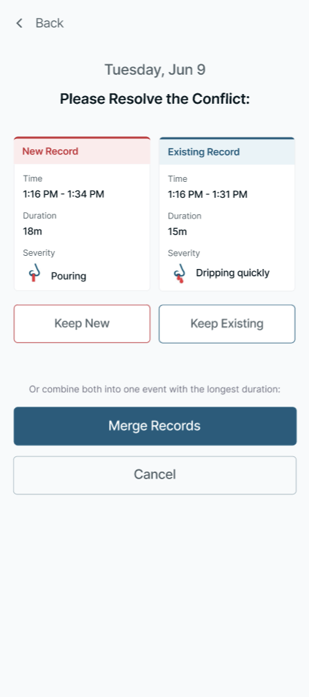

# *Diary* Entry Rules

The platform-level validation rules that apply to every *Diary* entry comprise the two-tier (justification, lock) time-based restrictions, the *Duration Reasonableness Check*, and the overlapping-event detection-and-*Resolution* flow.

## DIARY-PRD-entry-time-restrictions: Time-Based Entry Restrictions

**Level**: PRD | **Status**: Active | **Implements**: -

### Overview

Clinical *Trial* data integrity requires that *Participant*-reported data be contemporaneous. As time passes after an event, recall accuracy degrades and the risk of unreliable data increases. A two-tier restriction model balances the need for late data capture (with documented justification) against the need to prevent entries that are too old to be clinically reliable. The justification tier preserves ALCOA+ compliance by requiring documented reasons for non-contemporaneous entries. The lock tier enforces a hard boundary beyond which no data modification is permitted.

Justification Threshold
: The configurable elapsed time from midnight (00:00) of the event date in the **Participant's** local timezone after which the **Participant** must provide a reason before creating or editing an entry for that date.

Lock Threshold
: The configurable elapsed time from midnight (00:00) of the event date in the **Participant's** local timezone after which the date is fully locked and no creation, editing, or deletion of entries is permitted.

Entry Justification
: A reason selected from a sponsor-defined predefined list that the **Participant** must provide when creating or editing an entry that has exceeded the **Justification Threshold**.

### Assertions

**Justification Tier**

A. When the elapsed time for an event date exceeds the **Justification Threshold** but has not exceeded the **Lock Threshold**, the System SHALL require the **Participant** to select an **Entry Justification** before saving a new entry or an edit to an existing entry for that date.

B. The System SHALL NOT require an **Entry Justification** when the **Participant** deletes an entry within the justification window.

C. The System SHALL NOT allow free-text entry for **Entry Justification**.

D. The System SHALL store the selected **Entry Justification** with the entry record.

**Lock Tier**

E. When the elapsed time for an event date exceeds the **Lock Threshold**, the System SHALL NOT permit creation of new entries for that date.

F. When the elapsed time for an event date exceeds the **Lock Threshold**, the System SHALL NOT permit editing of existing entries on that date.

G. When the elapsed time for an event date exceeds the **Lock Threshold**, the System SHALL NOT permit deletion of existing entries on that date.

**Configuration**

H. The System SHALL support *Sponsor*-configurable **Justification Threshold** per study.

I. The System SHALL support *Sponsor*-configurable **Lock Threshold** per study.

J. The **Lock Threshold** SHALL be greater than or equal to the **Justification Threshold**.

K. The System SHALL support *Sponsor*-configurable definition of the **Entry Justification** predefined list per study.

L. When neither threshold is configured for a study, the System SHALL NOT apply time-based entry restrictions.

M. The **Lock Threshold** SHALL apply only to event dates on or after the ***Trial** Start* date.

### Rationale

The two-tier model exists because two distinct integrity concerns argue for two distinct boundaries. Recall accuracy degrades gradually after an event, so for some window after the event date the data is still useful but the *Participant* should explicitly acknowledge they are entering it late (this is the **Justification Threshold** — a soft boundary that captures a categorical reason on the record). Beyond a longer window, the data is no longer clinically reliable regardless of justification, so the platform makes it impossible to modify (the **Lock Threshold** — a hard boundary that disables create/edit/delete). Predefined-list justifications (rather than free-text) match the analyzability goal: the *Audit Trail* aggregates over a controlled vocabulary of reasons rather than over unbounded prose. Deletion within the justification window does not require justification because the *Participant* is removing data they reported, not modifying it; the *Audit Trail* still captures the deletion event and its own reason via the standard delete flow. The `Lock >= Justification` invariant ensures the two tiers compose correctly (a Justification-required state always precedes a Lock state for the same date). The "only after ***Trial** Start* date" qualifier on the **Lock Threshold** means pre-*Trial* historical entries (covered by the **Diary Start Day**) are not subject to the lock, since those entries are explicitly retrospective and the lock semantics don't apply.

### Changelog

- 2026-06-25 | 7edebe14 | - | Michael Lewis (michael@anspar.org) | First approved version

*End* *Time-Based Entry Restrictions* | **Hash**: 7edebe14

## DIARY-PRD-entry-duration-check: Duration Reasonableness Check

**Level**: PRD | **Status**: Draft | **Implements**: -

### Overview

Unusually short or long event durations may indicate data entry errors. Confirmation prompts at configurable thresholds help ensure data accuracy while allowing legitimate outlier events to be recorded.

Duration Reasonableness Check
: A configurable validation rule that prompts the **Participant** to confirm the recorded duration of an event when it falls outside expected boundaries.

Short Duration Threshold
: The configurable minimum duration below which a confirmation prompt is triggered.

Long Duration Threshold
: The configurable maximum duration above which a confirmation prompt is triggered.

### Assertions

**Short Duration Check**

A. When the duration of an event is less than the **Short Duration Threshold**, the System SHALL prompt the **Participant** to confirm the duration before saving.

B. The confirmation prompt SHALL provide a confirm option that saves the entry as entered and a reject option that returns the **Participant** to edit the duration.

**Long Duration Check**

C. When the duration of an event is greater than the **Long Duration Threshold**, the System SHALL prompt the **Participant** to confirm the duration before saving.

D. The confirmation prompt SHALL provide a confirm option that saves the entry as entered and a reject option that returns the **Participant** to edit the duration.

**Prompt Timing**

E. The System SHALL display the confirmation prompt before the save operation completes.

**Configuration**

F. The System SHALL support *Sponsor*-configurable **Short Duration Threshold** per study.

G. The System SHALL support *Sponsor*-configurable **Long Duration Threshold** per study.

H. The System SHALL support *Sponsor*-configurable enablement of each check independently per study.

I. When a check is not enabled for a study, the System SHALL NOT display the corresponding confirmation prompt.

### Rationale

Duration outliers are a common data-entry-error signal: a typo or wrong-timezone selection can produce a one-second or twelve-hour nosebleed that the *Participant* did not actually have. A soft confirmation prompt at configured boundaries catches these without rejecting legitimately-outlying events (a multi-hour nosebleed can be real for certain HHT participants). The two checks are independently enableable because a deployment may want only one direction (e.g. only the short-duration check, if long durations are clinically plausible in the protocol). The pre-save timing rule (assertion E) ensures the *Participant* sees the prompt at the moment of decision rather than discovering after the fact that their entry was flagged. Reject-and-edit is the inverse of confirm-and-save and gives the *Participant* a direct path to correct a typo without re-entering the event from scratch.

*End* *Duration Reasonableness Check* | **Hash**: fa7bd4b8

## DIARY-PRD-entry-overlap-resolution: Overlapping Event Detection and Resolution

**Level**: PRD | **Status**: Active | **Implements**: -

### Overview

Nosebleed events cannot physically *Overlap* — a *Participant* cannot have two simultaneous, independent nosebleeds. When a new record's time range intersects with an existing record, the system must detect the conflict and guide the *Participant* through *Resolution* before the record is committed. This ensures data integrity and prevents logically impossible entries from reaching the clinical dataset.

Overlap
: A state in which the time range of a new or edited entry intersects with the time range of one or more existing entries for the same **Participant**.

Conflicting Record
: An existing entry whose time range intersects with the entry being created or edited.

Resolution
: The **Participant's** choice of how to handle an **Overlap** between two entries.

### Assertions

**Detection**

A. The System SHALL evaluate for potential **Overlap** when the **Participant** sets the start time of a new or edited entry, and SHALL confirm the **Overlap** when the **Participant** sets the end time.

B. The System SHALL evaluate **Overlap** by comparing the actual start and end timestamps of the new or edited entry against all existing entries for the same **Participant**.

C. The System SHALL evaluate **Overlap** against both completed entries and ongoing entries.

**Pre-Resolution State**

D. When an **Overlap** is detected, the System SHALL save the new entry to persistent storage immediately upon creation.

E. When an **Overlap** is detected, the System SHALL NOT display the new entry in the **Participant's** *Diary* history until **Resolution** is complete.

**Resolution Sequencing**

F. The System SHALL present the **Participant** with one **Conflicting Record** at a time, starting with the oldest.

G. After each **Resolution** step, the System SHALL evaluate the resulting entry for further **Overlaps**.

H. The System SHALL repeat the **Resolution** flow until no **Overlaps** remain.

I. When all **Overlaps** are resolved, the System SHALL commit all resulting changes as a single transaction.

**Resolution Options**

J. For each **Overlap**, the System SHALL offer three *Resolution* options: keep the new entry and discard the **Conflicting Record**, keep the **Conflicting Record** and discard the new entry, or merge both entries into one.

**Merge Behavior**

K. When the **Participant** selects merge, the System SHALL construct the merged entry using the earliest start time and the latest end time across both entries.

L. When either entry in a merge is ongoing, the merged entry SHALL be ongoing.

M. When the **Participant** selects merge, the System SHALL assign the higher severity value from the two original entries to the merged entry.

**Post-Resolution Confirmation**

N. After any *Resolution* choice, the System SHALL present the resulting entry to the **Participant** for review and confirmation before committing.

O. The **Participant** SHALL be able to edit the resulting entry before confirming.

### Rationale

Two nosebleeds cannot physically *Overlap*; allowing overlapping records into the dataset would be silent data corruption. The two-stage detection (predictive on start-time, confirmatory on end-time) gives the *Participant* early notice that an *Overlap* is forming without interrupting them mid-record, then escalates to mandatory *Resolution* at the moment the conflict becomes a hard reality. Saving the new entry to persistent storage immediately on creation (assertion D) is the durability guarantee that the *Participant*'s work is not lost if the application crashes mid-*Resolution*; hiding it from the *Diary* history until *Resolution* completes (assertion E) keeps the *Participant*'s view consistent with what has actually been resolved. One-conflict-at-a-time *Resolution* starting with the oldest, repeated until no overlaps remain, is the only sequencing that handles the cascade case (a new record overlaps two existing records that themselves *Overlap* each other once merged). Three *Resolution* options cover the realistic choices: the new record was right and the old one was wrong (keep-new), the old record was right and the new one is a duplicate (keep-existing), or both were partial captures of one continuous event (merge). Merge using earliest-start / latest-end with the higher severity captures the union-by-time and max-by-severity that best represents one continuous event reconstructed from two partial captures. Pre-commit review is the final integrity gate — the *Participant* sees the resulting entry as the platform will save it and can edit any field before confirming.

### Screen reference

See: 

### Changelog

- 2026-06-25 | 1069b1e5 | - | Michael Lewis (michael@anspar.org) | First approved version

*End* *Overlapping Event Detection and Resolution* | **Hash**: 1069b1e5

## DIARY-GUI-entry-overlap-resolution: Overlapping Event Resolution Flow

**Level**: GUI | **Status**: Active | **Implements**: -
**Refines**: DIARY-PRD-entry-overlap-resolution

### Overview

When an *Overlap* is detected, the **Participant** needs early warning and a clear *Resolution* path. Displaying a warning as soon as the start time indicates a potential conflict gives the **Participant** awareness without interrupting their recording flow. Once the full time range is established, the *Resolution* screen provides a side-by-side comparison and straightforward actions to resolve the conflict.

Resolution Screen
: The screen presented to the **Participant** when an **Overlap** is confirmed, displaying the new entry and the **Conflicting Record** side by side with available resolution actions.

### Assertions

**Early Warning**

A. When a potential **Overlap** is detected after the **Participant** sets the start time, the interface SHALL display a warning indicating that overlapping events have been detected and the number of conflicting records.

B. The warning SHALL NOT prevent the **Participant** from continuing the recording flow.

**Resolution Trigger**

C. When the **Participant** sets the end time and the **Overlap** is confirmed, the interface SHALL navigate the **Participant** to the **Resolution Screen**.

**Resolution Screen**

D. The interface SHALL present the **Resolution Screen** displaying the new entry and the **Conflicting Record** side by side.

E. Each entry on the **Resolution Screen** SHALL display the time range, duration, and severity.

F. When the **Conflicting Record** is older than the **Justification Threshold**, the System SHALL require an **Entry Justification** before saving the *Resolution*.

G. The **Resolution Screen** SHALL present a Keep New *Action* and a Keep Existing *Action*. The *Resolution* Screen SHALL present a Merge Records *Action* only when the *Conflicting Record*'s event date has not exceeded the **Lock Threshold**.

H. The Merge Records *Action* SHALL display a description indicating that both records will be combined into one event.

**Post-Resolution**

I. When the Merge Records *Action* is unavailable due to the **Lock Threshold**, the *Resolution* Screen SHALL display a message indicating that the *Conflicting Record* is locked and cannot be merged.

J. After the **Participant** selects any *Resolution* option (Keep New, Keep Existing, or Merge Records), the interface SHALL navigate to the standard **Record Nosebleed** screen pre-filled with the resulting entry data.

K. The **Record Nosebleed** screen SHALL allow the **Participant** to review and edit any field of the resulting entry before confirming.

**Multiple Conflicts**

L. When multiple **Overlaps** exist, the interface SHALL present one **Resolution Screen** at a time.

M. When all **Overlaps** are resolved and the **Participant** confirms the final entry, the interface SHALL return the **Participant** to the *Main Screen*.

### Rationale

The early warning on start-time is a non-blocking signal: the *Participant* sees that something is going to need *Resolution* but is not pushed into the *Resolution* flow yet, because the end-time may still make the *Overlap* go away (e.g. the *Participant* moves the end time earlier than the *Conflicting Record*'s start). Only when the end-time confirms the conflict does the GUI commit the *Participant* to the **Resolution Screen**. The side-by-side display makes the comparison legible — same time-range / duration / severity rows for both entries — so the *Participant* can make an informed choice between Keep New, Keep Existing, and Merge. The Merge-availability check against the **Lock Threshold** is required because merging would produce edits to the *Conflicting Record*'s date, which the lock prohibits; surfacing the unavailability with an explanatory message (rather than silently disabling) keeps the *Participant* oriented. Routing the post-*Resolution* result through the standard **Record Nosebleed** screen (pre-filled) gives the *Participant* a final edit-and-confirm opportunity on the same surface they used to enter the original record — a single interaction model end-to-end rather than a *Resolution*-specific screen the *Participant* has to learn separately. One-at-a-time presentation for multiple overlaps matches the PRD-level *Resolution* sequencing rule, and the return-to-Main-Screen on completion closes the recording journey at its natural endpoint.

> **Follow-up — configurability**: This requirement currently encodes
> the only option implemented in code. Future sponsors may require
> different rules; introduce a configurable seam (e.g. a parameter on
> the *Sponsor*-overlay parent, or a new platform-side template the
> *Sponsor*-overlay REQ Satisfies) when the need arises. Until that seam
> exists, this REQ is normative for the current deployment.

### Screen reference

See: 

### Changelog

- 2026-06-25 | 7bee74de | - | Michael Lewis (michael@anspar.org) | First approved version

*End* *Overlapping Event Resolution Flow* | **Hash**: 7bee74de
