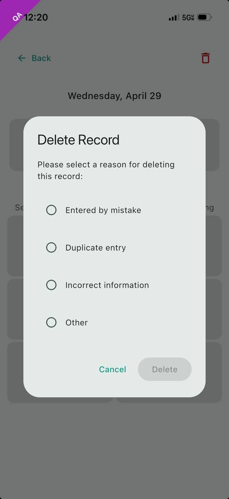

# Daily eDiary: HHT Epistaxis Data Capture

The daily eDiary data-capture flow for **Epistaxis Events** comprises the platform-level data capture standard, the *Participant*-facing recording flow (Start, Max *Intensity*, End), and the deletion flow (in-flight during recording and post-save from event history).

## DIARY-PRD-epistaxis-capture-standard: HHT Epistaxis Data Capture Standard

**Level**: PRD | **Status**: Draft | **Implements**: -
**Refines**: DIARY-BASE-mobile-diary-application

### Overview

The HHT Epistaxis Data Capture Standard defines the requirements for *Participant*-reported nosebleed event collection in HHT clinical trials. Epistaxis frequency, duration, and severity are primary outcome measures for evaluating treatment efficacy. Timezone-aware timestamps ensure precise duration calculation regardless of *Participant* location.

Daily Status
: The participant's self-reported summary of nosebleed activity for a given day. Valid values are Had Nosebleed, No Nosebleed, and Don't Remember.

Intensity
: A participant-reported measure of nosebleed severity captured on a defined six-level scale ordered from least to most severe.

Incomplete Record
: An **Epistaxis Event** that has been saved but is missing one or more required fields: start time, **Intensity**, or end time.

### Assertions

A. The System SHALL require a *Participant* to record a **Daily Status** for each *Calendar* day within the *Diary* period.

B. The System SHALL enforce mutual exclusivity of the three **Daily Status** values — a *Participant* SHALL NOT record more than one **Daily Status** per *Diary* entry.

C. When a *Participant* records a **Daily Status** of Had Nosebleed, the System SHALL require the *Participant* to provide start time and end time for the **Epistaxis Event** with timezone information.

D. The System SHALL calculate the duration of an **Epistaxis Event** from the recorded start time and end time, accounting for timezone differences.

E. The System SHALL require the *Participant* to record an **Intensity** value for each **Epistaxis Event**.

F. The System SHALL present notes options from a predefined list for each **Epistaxis Event**; the available options SHALL be *Sponsor*-configurable per study protocol.

G. The System SHALL classify an **Epistaxis Event** as an **Incomplete Record** when it has been saved with one or more required fields not recorded.

### Rationale

The *Daily Status* / *Epistaxis Event* two-level structure exists because the clinical question is two-leveled: "Did anything happen today?" (a daily-grain answer that can be Had Nosebleed, No Nosebleed, or Don't Remember) and, when something did happen, "What were the events?" (per-event start, end, *Intensity*). Mutually exclusive **Daily Status** values prevent contradictory records (a *Participant* cannot simultaneously have had a nosebleed and not had one). Required start, end, and **Intensity** on each **Epistaxis Event** capture the three primary outcome measures (frequency by count, duration by interval, severity by *Intensity*); allowing any of these to be missing without an explicit incomplete-*Record State* would silently downgrade dataset quality. Timezone-aware capture is essential because participants travel and durations computed from naive timestamps across a DST boundary or international move can be off by an hour or more. The **Incomplete Record** classification lets the platform distinguish "in progress, missing data" from "fully captured" so the *Participant* can be prompted to finish and the dataset can flag what is not yet complete.

*End* *HHT Epistaxis Data Capture Standard* | **Hash**: 20e8ce77

## DIARY-GUI-epistaxis-record: Record Nosebleed Event

**Level**: GUI | **Status**: Draft | **Implements**: -
**Refines**: DIARY-PRD-epistaxis-capture-standard

### Overview

The nosebleed recording flow walks the *Participant* through three steps — **Start** time, **Max Intensity**, **End** time — visible at all times in a persistent **Progress Indicator** at the top of every screen. The *Participant* can revisit any completed step. Validation at the End Time step prevents impossible records (end before start, end after current real time) and prompts for confirmation on entries that look like they may have been recorded too quickly after the event.

Progress Indicator
: The persistent bar displayed at the top of every screen in the recording flow showing the three steps — Start, Max Intensity, and End — and their completion state.

Time Picker
: The time selection component presenting the current time as default, a date selector, a timezone selector, and minute adjustment controls of -15, -5, -1, +1, +5, and +15 minutes.

Max Intensity
: The peak **Intensity** recorded for an **Epistaxis Event** during the nosebleed recording flow.

### Assertions

**Flow Structure**

A. The interface SHALL display the **Progress Indicator** on every screen throughout the recording flow showing the Start, Max *Intensity*, and End steps.

B. The interface SHALL highlight the active step in the **Progress Indicator** and show the recorded value for each completed step.

C. The interface SHALL allow the *Participant* to navigate to any previously completed step by tapping it in the **Progress Indicator**.

D. The interface SHALL present a Back navigation *Action* on every screen throughout the recording flow.

**Nosebleed Start Time**

E. The interface SHALL present a **Time Picker** for the *Participant* to set the nosebleed start time.

F. The interface SHALL present a Set Start Time button that confirms the start time and advances to the Max *Intensity* screen.

**Max Intensity**

G. The interface SHALL present the six *Intensity* options as a selectable grid: Spotting, Dripping, Dripping quickly, Steady stream, Pouring, and Gushing.

H. The interface SHALL NOT advance to the End Time screen until the *Participant* has selected one of the *Intensity* options.

I. When the *Participant* selects an *Intensity* option, the interface SHALL highlight the selected option and automatically advance to the End Time screen.

**Nosebleed End Time**

J. The interface SHALL present a **Time Picker** for the *Participant* to set the nosebleed end time.

K. When the *Participant* selects Set End Time, the interface SHALL save the record and return the *Participant* to the home screen.

L. The System SHALL validate that end time is greater than or equal to start time.

M. The System SHALL restrict end time selection to times not exceeding the current real time.

N. The System SHALL require confirmation when creating entries less than 2 minutes old.

### Rationale

The three-step structure (Start, Max *Intensity*, End) matches the clinical model of an event (when it began, how bad it got, when it ended); making the **Progress Indicator** persistent across every screen of the flow keeps the *Participant* oriented and allows direct navigation to any completed step without back-tracking. The **Time Picker**'s minute-adjustment chips (-15/-5/-1/+1/+5/+15) target the realistic adjustment granularity for recording a recently-completed event and avoid the precision-mismatch of a free-text time entry. The auto-advance on *Intensity* selection (vs. requiring a separate Next tap) shaves friction from the most common path (set start, pick *Intensity*, set end) while still letting the *Participant* revisit via the **Progress Indicator** if they want to change their *Intensity* choice. End-time validation (no earlier than start, no later than now) catches the two impossible-time inputs at the GUI layer rather than relying on later data validation. The two-minute confirmation prompt is a soft-stop against premature *Finalization* — a *Participant* who is still actively having a nosebleed when they set the end time is reminded to check before committing.

> **Follow-up — configurability**: This requirement currently encodes
> the only option implemented in code. Future sponsors may require
> different rules; introduce a configurable seam (e.g. a parameter on
> the *Sponsor*-overlay parent, or a new platform-side template the
> *Sponsor*-overlay REQ Satisfies) when the need arises. Until that seam
> exists, this REQ is normative for the current deployment.

*End* *Record Nosebleed Event* | **Hash**: 83c8479f

## DIARY-GUI-epistaxis-delete: Nosebleed Event Delete

**Level**: GUI | **Status**: Draft | **Implements**: -
**Refines**: DIARY-PRD-epistaxis-capture-standard

### Overview

Deletion of a nosebleed event can happen in two contexts: in-flight during the recording flow (before the record has been saved) and post-save from event history. Both paths require a **Reason Dialog — Predefined List** before the deletion is applied, and the *Participant* may cancel at any point.

### Assertions

**Delete During Recording Flow**

A. The interface SHALL present a delete *Action* on every screen throughout the recording flow.

B. When the *Participant* selects the delete *Action* during the recording flow, the interface SHALL display a **Reason Dialog — Predefined List** before proceeding.

C. When the *Participant* confirms the delete reason, the interface SHALL discard the in-progress record and return the *Participant* to the home screen.

D. When the *Participant* cancels the Reason Dialog, the interface SHALL return the *Participant* to the screen they were on.

**Delete From Event History**

E. When the *Participant* selects the delete *Action* on a saved **Epistaxis Event**, the interface SHALL display a **Reason Dialog — Predefined List** before proceeding.

F. When the *Participant* confirms the delete reason, the interface SHALL remove the event from the *Participant*'s *Diary* and return the *Participant* to the previous screen.

G. When the *Participant* cancels the Reason Dialog, the **Epistaxis Event** SHALL remain unchanged.

### Rationale

The delete *Action* is exposed on every screen of the recording flow because the *Participant* may realize partway through that they started the record by mistake (wrong date, wrong event, accidental tap) and there is no benefit to forcing them to complete the flow before deleting. Routing both in-flight delete and post-save delete through a **Reason Dialog — Predefined List** keeps the *Audit Trail*'s deletion-reason capture consistent across both contexts — a deletion at any point produces a categorized reason record. Predefined-list (rather than free-text) reasons match the dataset analyzability goal: deletion reasons are the kind of metadata downstream analysis aggregates over, and a controlled vocabulary makes that analysis tractable. The cancel path on either delete returns the *Participant* to where they were (in-flight: the same screen; post-save: the previous screen, with the record unchanged) so an accidental delete-tap is fully recoverable.

> **Follow-up — configurability**: This requirement currently encodes
> the only option implemented in code. Future sponsors may require
> different rules; introduce a configurable seam (e.g. a parameter on
> the *Sponsor*-overlay parent, or a new platform-side template the
> *Sponsor*-overlay REQ Satisfies) when the need arises. Until that seam
> exists, this REQ is normative for the current deployment.

### Screen reference

See: 

*End* *Nosebleed Event Delete* | **Hash**: 0cb2cfd1

## DIARY-PRD-day-disposition: Calendar Day Disposition

**Level**: PRD | **Status**: Draft | **Implements**: -
**Refines**: DIARY-PRD-epistaxis-capture-standard

### Overview

A *Calendar* day carries at most one *summary* disposition: a recorded nosebleed (one or more **Epistaxis Events**), a No-Nosebleed marker, or a Don't-Remember marker. A day-level marker and a recorded **Epistaxis Event** never coexist in the day's summary. The *Participant* can re-disposition a day whose current disposition is a marker; recording a nosebleed on a marker-only day converts the day — the marker is replaced — whereas a recorded nosebleed is changed only by editing or deleting it.

### Assertions

A. The System SHALL derive a single summary disposition for each *Calendar* day — one or more recorded **Epistaxis Events**, a No-Nosebleed marker, or a Don't-Remember marker — such that a day-level marker and a recorded **Epistaxis Event** never coexist in the day's summary.

B. The System SHALL allow the *Participant* to re-disposition a day whose current disposition is a marker, choosing No-Nosebleed, Don't-Remember, or recording an **Epistaxis Event**.

C. When a *Participant* records an **Epistaxis Event** on a day whose only entry is a marker, the System SHALL replace the marker; when the day already has one or more **Epistaxis Events**, the System SHALL add the new event to that day.

D. The System SHALL treat marker-to-**Epistaxis Event** conversion as one-way; once recorded, an **Epistaxis Event** is changed only by editing or deleting it, not by re-disposition.

### Rationale

The recording-time rule that a *Participant* records one **Daily Status** per day answers "what may be entered"; this requirement governs the *derived* day summary the *Calendar* and home views present — collapsing a day's events and markers into one disposition so the *Participant* sees a coherent "what happened that day" at a glance. A marker and a real nosebleed cannot both stand as the day's summary, so recording a nosebleed on a marker-only day converts the day by replacing the marker, while additional nosebleeds simply accumulate. Conversion is one-way because a marker is a lightweight assertion about a day whereas a recorded **Epistaxis Event** is captured data; once captured, it is edited or deleted explicitly, never silently overwritten by a re-disposition tap.

*End* *Calendar Day Disposition* | **Hash**: bd38485a

## DIARY-PRD-incomplete-entry-preservation: Incomplete Entry Preservation

**Level**: PRD | **Status**: Draft | **Implements**: -
**Refines**: DIARY-PRD-epistaxis-capture-standard

### Overview

A *Participant* interrupted partway through recording must not lose what they entered, and an unfinished entry must not masquerade as a finished record. The *Diary* auto-preserves a partial entry as a resumable draft, surfaces it as an incomplete-entry reminder, and promotes it to a finalized entry only on explicit completion. Drafts are *Diary*-local until finalized.

### Assertions

A. When a *Participant* exits the recording flow with an incomplete entry, the System SHALL auto-preserve it as a resumable draft without prompting the *Participant*.

B. The System SHALL surface preserved drafts to the *Participant* as incomplete-entry reminders that can be re-opened for completion.

C. When a *Participant* completes a draft, the System SHALL promote it to a finalized entry on the same record, and the draft SHALL no longer appear as incomplete.

D. The System SHALL keep preserved drafts *Diary*-local — excluded from the shared canonical entry view and not synchronized as canonical data until finalized.

### Rationale

Recording can be interrupted — a phone call, a closed app, a low battery — and a *Participant* who loses a half-entered nosebleed is unlikely to re-enter it accurately, costing dataset completeness; auto-preserving the partial entry as a draft, without an interrupting prompt, keeps the path frictionless. The draft surfaces as an incomplete-entry reminder so the *Participant* is nudged to finish rather than forgetting it exists. Promoting on the same record (rather than creating a second entry) keeps the event lineage intact. Holding drafts *Diary*-local until finalized is the integrity boundary: an unfinished record never enters the shared canonical view or syncs as data, so "in progress" can never be mistaken for "reported".

*End* *Incomplete Entry Preservation* | **Hash**: 85ecdc0f
