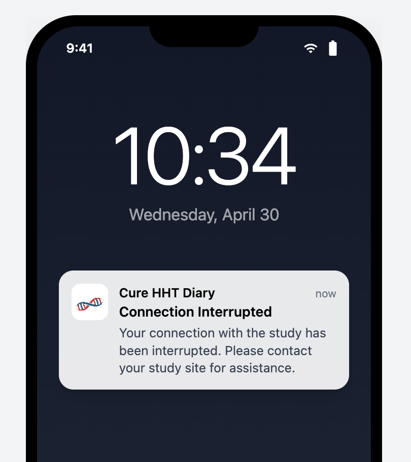
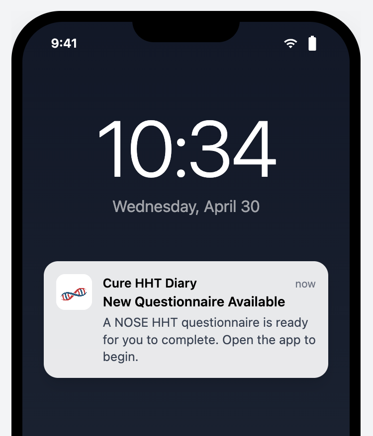
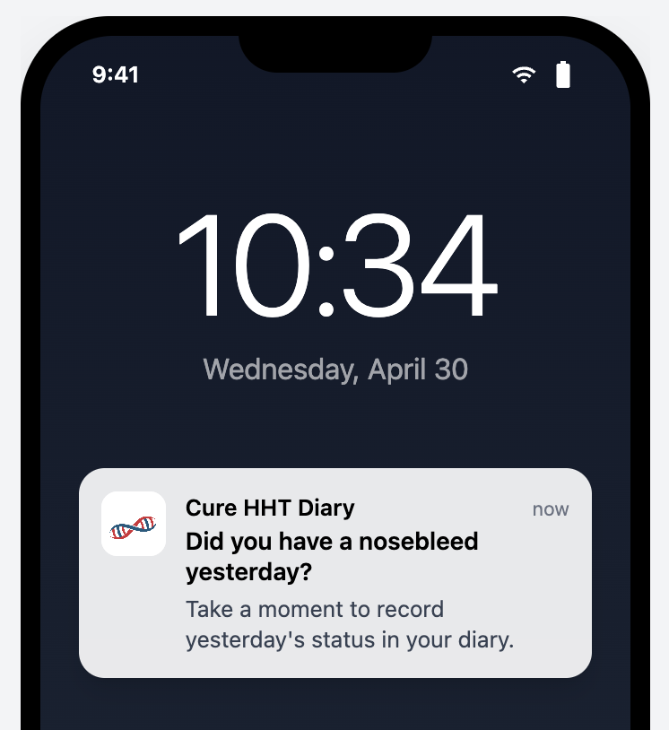
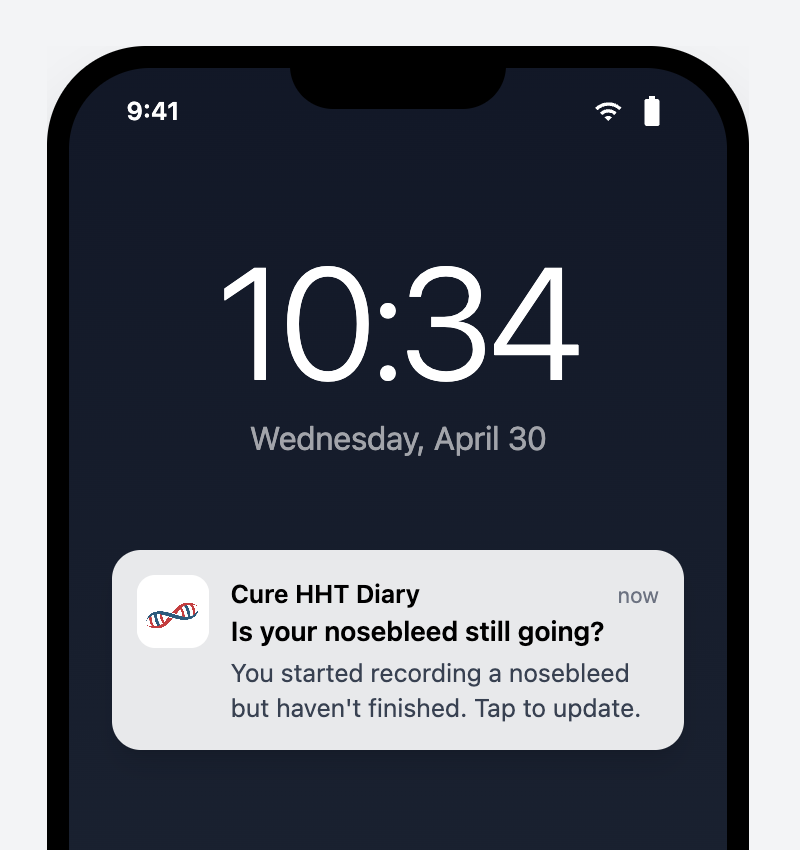
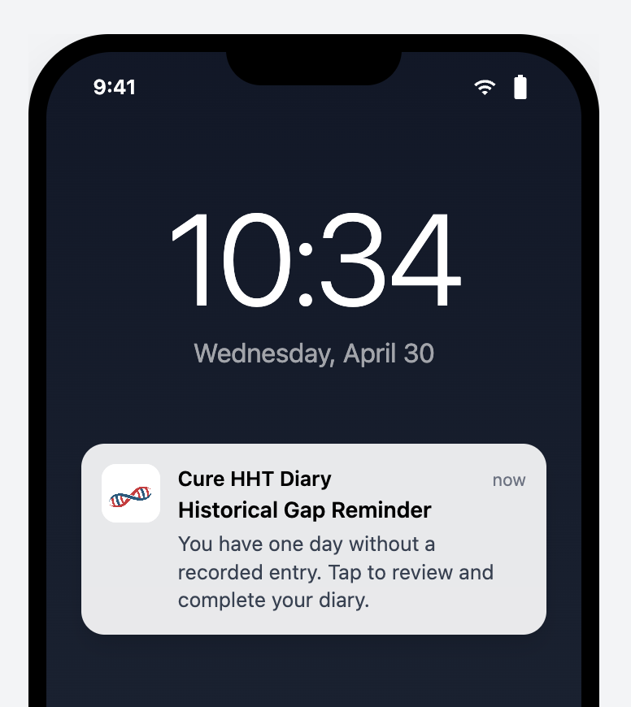

# *Participant* Tasks and Notifications

The **Mobile Application** delivers a set of push notifications and reminders to the **Participant**, together with the on-screen **Task List** and **Participation Status Badge** that surface task-state information in the app itself. The push notifications defined here all conform to the cross-cutting `DIARY-PRD-notification-behavior` template (tap behavior, no in-notification actions, offline-deferred delivery).

## DIARY-GUI-participant-task-list: Participant Task List

**Level**: GUI | **Status**: Draft | **Implements**: -

### Overview

The *Task List* provides **Participants** with a prioritized set of actions requiring their attention. Displaying tasks prominently on the **Main Screen** and linking directly to the relevant flows reduces friction and encourages timely data entry. Tasks are automatically resolved as the **Participant** addresses them, keeping the list current.

Task List
: The prioritized set of actionable items displayed on the **Participant's** **Main Screen** requiring **Participant** attention.

Incomplete Records Task
: A task indicating the **Participant** has one or more saved entries with missing required data.

Questionnaire Task
: A task indicating a **Portal-Sent Questionnaire** has been sent to the **Participant** and has not yet been submitted.

Yesterday Reminder Task
: A task prompting the **Participant** to record a **Daily Status** for the previous day.

### Assertions

**Task Types and Priority**

A. The **Task List** SHALL support the following task types, displayed in the priority order listed:

| Priority | Task Type | Trigger | Removal |
| :---- | :---- | :---- | :---- |
| 1 | **Incomplete Records Task** | **Participant** has one or more saved entries with missing required data | All incomplete entries are completed or deleted |
| 2 | **Questionnaire Task** | *Study Coordinator* sends a **Portal-Sent Questionnaire** | *Sponsor* finalizes the *Questionnaire* |
| 3 | **Yesterday Reminder Task** | New day begins and the **Participant** has not recorded a **Daily Status** for the previous day | **Participant** records a **Daily Status** for the previous day |

**Incomplete Records Task**

B. The **Incomplete Records Task** SHALL display the count of incomplete entries.

C. When the **Participant** selects the **Incomplete Records Task**, the interface SHALL navigate to a screen listing all incomplete entries.

D. From the incomplete entries screen, the **Participant** SHALL be able to complete or delete each entry.

E. The **Incomplete Records Task** SHALL persist regardless of the age of the incomplete entries.

**Questionnaire Task**

F. The interface SHALL display one **Questionnaire Task** per **Questionnaire Type**.

G. When the **Participant** selects a **Questionnaire Task**, the interface SHALL navigate to the *Questionnaire* flow for that **Portal-Sent Questionnaire**.

H. After the *Participant* submits a **Portal-Sent Questionnaire**, the *Questionnaire* SHALL be accessible as a record on the day it was submitted via the **Calendar**.

I. After the *Sponsor* finalizes the **Portal-Sent Questionnaire**, the **Questionnaire Task** SHALL be removed from the **Task List**.

J. After **Submission**, the **Questionnaire Task** SHALL display a completed visual state indicating the *Questionnaire* has been submitted and is awaiting *Sponsor* review.

K. While the **Questionnaire Task** is in a submitted state, the *Participant* SHALL be able to select it to review and edit their answers.

**Yesterday Reminder Task**

L. The **Yesterday Reminder Task** SHALL present three response actions: Yes, No, and Don't Remember.

M. When the **Participant** selects No, the interface SHALL record a **Daily Status** of No Nosebleed for the previous day and remove the task.

N. When the **Participant** selects Don't Remember, the interface SHALL record a **Daily Status** of Don't Remember for the previous day and remove the task.

O. When the **Participant** selects Yes, the interface SHALL navigate the **Participant** to the nosebleed recording flow with the date set to the previous day.

P. The **Yesterday Reminder Task** SHALL NOT appear if the **Participant** has already recorded a **Daily Status** for the previous day.

**General Behavior**

Q. Tasks SHALL be removed from the **Task List** when their removal condition is met.

R. The **Task List** SHALL update as conditions change without requiring the **Participant** to refresh.

### Rationale

The three task types correspond to the three categories of follow-up the platform needs to surface to the *Participant*: data the *Participant* already entered that is missing required fields (**Incomplete Records Task**), questionnaires the **Study Coordinator** has assigned that have not been submitted (**Questionnaire Task**), and the daily-status prompt for yesterday (**Yesterday Reminder Task**). The priority ordering reflects intervention urgency: incomplete records are at risk of becoming permanently locked (highest priority), questionnaires are due but not yet on a hard deadline (middle), and yesterday's status is a soft prompt that auto-resolves over time (lowest). The **Yesterday Reminder Task**'s three-*Action* surface (Yes / No / Don't Remember) lets the *Participant* resolve the task without leaving the *Main Screen* for the common case (Yes navigates to recording; No and Don't Remember commit the **Daily Status** in place). Removing tasks the moment their removal condition is met (and not requiring a refresh) keeps the list honest — a *Participant* who completes their incomplete records sees the task disappear immediately, rather than being told to refresh or re-open the app. **Incomplete Records Task** persistence regardless of age (assertion E) is the operational counterpart of the **Lock Threshold**: even after the underlying record is locked and can no longer be completed, the task stays visible so the *Participant* is aware of the now-permanently-incomplete state.

> **Follow-up — configurability**: This requirement currently encodes
> the only option implemented in code. Future sponsors may require
> different rules; introduce a configurable seam (e.g. a parameter on
> the CAL-PRD-* parent, or a new platform-side template the CAL- REQ
> Satisfies) when the need arises. Until that seam exists, this REQ is
> normative for the Callisto deployment.

*End* *Participant Task List* | **Hash**: 916aca8a

## DIARY-PRD-notification-disconnection: Disconnection Notification

**Level**: PRD | **Status**: Draft | **Implements**: -

### Overview

**Participants** need immediate, clear notification when their *Mobile Application* is disconnected from the *Sponsor* portal. A persistent, non-dismissible notification ensures the **Participant** is always aware of their disconnected state and cannot accidentally or intentionally hide it.

Disconnection Notification
: A persistent, non-dismissible notification displayed to the **Participant** when their mobile Application is disconnected from the **Sponsor Portal**.

### Assertions

A. When a **Participant's** status is **Disconnected**, the System SHALL display a **Disconnection Notification** on the **Main Screen**.

B. The **Disconnection Notification** SHALL persist until the **Participant** is reconnected to the **Sponsor Portal**.

C. The **Disconnection Notification** SHALL NOT be dismissible by the **Participant**.

D. The System SHALL support *Sponsor*-configurable message content for the **Disconnection Notification**.

E. When no *Sponsor*-specific message content is configured, the **Disconnection Notification** SHALL display the following default message: "Your connection with the study has been interrupted. Please contact your study *Site* for assistance."

### Rationale

Disconnection is an operational state with clinical-data consequences: data the *Participant* enters while disconnected does not reach the *Sponsor* and may sit unsynced for an indeterminate period. The *Participant* needs to know they are disconnected so they can either resolve it (contact their *Site* for a new *Linking Code*) or at minimum understand why their data is not visible to the *Sponsor*. Persistent + non-dismissible is the only display mode that survives the *Participant*'s natural impulse to clear unfamiliar notifications: a dismissible disconnection banner would be cleared within minutes by most participants, and the disconnection would then be invisible to them on every subsequent app open. The *Sponsor*-configurable message + default text lets each deployment customize the language (e.g. *Site* contact phone numbers, terminology consistent with the *Sponsor*'s other communications) while keeping a working default for deployments that don't configure it.

### Screen reference

See: 

*End* *Disconnection Notification* | **Hash**: ac967ad3

## DIARY-GUI-participation-status-badge: Participation Status Badge

**Level**: GUI | **Status**: Draft | **Implements**: -
**Refines**: DIARY-PRD-notification-disconnection

### Overview

The **Participation Status Badge** gives **Participants** a persistent, at-a-glance view of their clinical *Trial* involvement. The badge adapts its display based on the **Participant's** current status so they always know whether they are connected, disconnected, or no longer participating in a study.

Participation Status Badge
: The visual component displayed in the Clinical Trial section of the user profile screen showing the **Participant's** current study participation state and associated details.

### Assertions

**Placement**

A. The interface SHALL display the **Participation Status Badge** in the Clinical *Trial* section of the *User* profile screen.

**Linked State**

B. When the **Participant's** status is **Linked - Awaiting Start** or **Trial Active**, the **Participation Status Badge** SHALL display the *Sponsor* logo, the **Participant's** *Linking Code*, and the date and time the **Participant** joined.

C. The **Participation Status Badge** SHALL include a link to the **Clinical Trial Privacy Policy** from the moment the *Participant* links to the study, and the link SHALL remain available thereafter regardless of subsequent status changes.

**Disconnected State**

D. When the **Participant's** status is **Disconnected**, the **Participation Status Badge** SHALL display a warning indicator, the **Participant's** current *Linking Code*, and a message that the connection has been interrupted.

E. When the **Participant's** status is **Disconnected**, the **Participation Status Badge** SHALL present an Enter New *Linking Code* *Action* that navigates the **Participant** to the *Linking Code* entry screen.

**Not Participating State**

F. When the **Participant's** status is **Not Participating**, the **Participation Status Badge** SHALL display in an inactive visual style with the end date of participation.

**Automatic Update**

G. The **Participation Status Badge** SHALL update automatically when the **Participant's** status changes.

H. The System SHALL support *Sponsor*-configurable display of the *Sponsor* logo on the **Participation Status Badge** when the **Participant's** status is **Not Participating**.

### Rationale

The badge consolidates "where do I stand with this study" into a single visual the *Participant* always finds in the same place (Clinical *Trial* section of the *User* Profile). Three state variants cover the three operational situations: actively-linked (*Sponsor* logo, *Linking Code*, join date — full participation context), disconnected (warning indicator, *Linking Code*, Enter New *Linking Code* *Action* — the recovery path is reachable from the badge itself), and not-participating (inactive style with end date — the badge persists as historical evidence of past participation without competing for attention against current state). The *Clinical *Trial* Privacy Policy* link persists across status changes because the policy version the *Participant* consented to is part of their permanent record, and they have a continuing right to retrieve it. Automatic update on status change is the standard freshness guarantee; *Sponsor*-configurable logo display in the Not Participating state lets the deployment decide whether the badge in its end-of-participation state still carries *Sponsor* branding (an end-of-*Trial* communication preference).

> **Follow-up — configurability**: This requirement currently encodes
> the only option implemented in code. Future sponsors may require
> different rules; introduce a configurable seam (e.g. a parameter on
> the CAL-PRD-* parent, or a new platform-side template the CAL- REQ
> Satisfies) when the need arises. Until that seam exists, this REQ is
> normative for the Callisto deployment.

*End* *Participation Status Badge* | **Hash**: 6f306233

## DIARY-PRD-notification-incomplete-record-lock: Incomplete Record Lock Warning Notification

**Level**: PRD | **Status**: Draft | **Implements**: -

### Overview

Once an **Incomplete Record** reaches the *Lock Threshold* defined in *Diary*-PRD-entry-time-restrictions, the *Participant* cannot complete, edit, or delete it — the record is permanently retained in its incomplete state. To give Participants a final opportunity to act before this irreversible lock, the **System** sends a push notification at a configurable time before the lock fires. This requirement defines the platform mechanism; the trigger offset and notification text are *Sponsor*-configurable.

Lock Warning Offset
: The configurable elapsed time before the Lock Threshold at which the **System** sends a push notification to the Participant about an **Incomplete Record** that has not been completed or deleted.

### Assertions

**Notification Behavior**

A. The **System** SHALL send a push notification to the *Participant* when an **Incomplete Record** reaches the *Lock Warning Offset* before the *Lock Threshold* defined in *Diary*-PRD-entry-time-restrictions.

B. The **System** SHALL send the notification only once per **Incomplete Record**.

C. When a *Participant* completes or deletes an **Incomplete Record** before the *Lock Warning Offset* is reached, the **System** SHALL NOT send the notification for that record.

**Configuration**

D. The **System** SHALL support a *Sponsor*-configurable *Lock Warning Offset* per deployment.

E. The **System** SHALL support *Sponsor*-configurable notification text per deployment.

F. When the *Lock Warning Offset* is not configured for a deployment, the **System** SHALL NOT send the notification.

G. The *Lock Warning Offset* SHALL be less than the *Lock Threshold* defined in *Diary*-PRD-entry-time-restrictions.

### Rationale

The **Lock Threshold** produces an irreversible state — once exceeded, the **Incomplete Record** is permanently retained in its missing-field state and cannot be completed, edited, or deleted. The lock-warning notification exists because that irreversible outcome benefits from one final *Participant* nudge before it lands; without the warning, a *Participant* who simply forgot about an *Incomplete Record* discovers the permanent lock only on next app open, long after they could have done anything about it. Once-per-record (assertion B) prevents notification spam from a single long-lingering record; suppression on completion or deletion before the warning offset (assertion C) avoids notifying about records the *Participant* has already resolved. The opt-out semantics (not configured = no notification) and the Lock-Warning-less-than-Lock-Threshold invariant compose with the parent **Entry Time Restrictions** REQ — if a deployment hasn't configured the parent thresholds, the warning has no boundary to anchor to and is therefore not sent.

*End* *Incomplete Record Lock Warning Notification* | **Hash**: 304d6ab8

## DIARY-PRD-notification-portal-sent-questionnaire: Portal-Sent Questionnaire Notification

**Level**: PRD | **Status**: Draft | **Implements**: -

### Overview

When a **Study Coordinator** sends a **Portal-Sent Questionnaire** from the *Sponsor* Portal, the **Participant** must be made aware that a new *Questionnaire* is available for completion. A push notification serves as the awareness mechanism. The ***Questionnaire** Task* on the **Main Screen** provides the **Participant**'s entry point into the *Questionnaire* flow once the application is open.

### Assertions

**Trigger**

A. When a **Portal-Sent **Questionnaire** is successfully delivered to the Mobile Application**, the System SHALL deliver a **Push Notification** to the **Participant**.

**Offline Delivery**

B. When the **Mobile Application** is offline at the time a **Portal-Sent **Questionnaire** is sent, the System SHALL deliver the Push Notification** when the **Mobile Application** next establishes connectivity.

**Suppression**

C. The System SHALL NOT deliver a **Push Notification** for a **Portal-Sent **Questionnaire** that has already been submitted by the Participant**.

D. The System SHALL NOT deliver a **Push Notification** for a **Portal-Sent **Questionnaire** that has been called back by the Study Coordinator**.

### Rationale

The push notification is the *Participant*'s awareness signal that a new **Portal-Sent Questionnaire** is waiting; without it, the *Participant* would discover the *Questionnaire* only when they happen to open the app, which can extend the response window beyond what the **Study Coordinator** intended. Trigger-on-delivery (rather than trigger-on-send-from-portal) is the correct boundary because delivery is what actually puts the *Questionnaire* on the *Participant*'s device; sending from the portal to an offline device is a *Sponsor*-side *Action* that has no *Participant*-side effect yet. Offline-deferred delivery follows the cross-cutting notification template — the OS deferred-delivery mechanism is sufficient for the nudge purpose. *Submission* and call-back suppression closes the two cases where the notification would be misleading: a *Questionnaire* already submitted no longer needs the *Participant*'s attention, and a called-back *Questionnaire* is no longer assigned to them and a notification would invite wasted effort on an inactive *Questionnaire*.

### Screen reference

See: 

*End* *Portal-Sent Questionnaire Notification* | **Hash**: 88bc4533

## DIARY-PRD-notification-yesterday-entry: Yesterday Entry Reminder Notification

**Level**: PRD | **Status**: Draft | **Implements**: -

### Overview

Clinical *Trial* data completeness under ALCOA+ principles requires a **Daily Status** for each *Calendar* day in the *Diary* period. A daily reminder fired at a configured time of day prompts the **Participant** to review the previous day and respond via the *Yesterday Reminder Task* on the **Main Screen**.

Reminder Time
: The configurable time of day, in the **Participant**'s local timezone, at which the Yesterday Entry Reminder Notification is delivered.

### Assertions

**Trigger**

A. The System SHALL deliver a **Push Notification** at the **Reminder Time** when no **Daily Status** has been recorded for the previous *Calendar* day.

**Timezone**

B. The System SHALL evaluate the **Reminder Time** against the **Participant**'s device local timezone.

C. The System SHALL evaluate "the previous *Calendar* day" against the **Participant**'s device local timezone.

**Suppression**

D. The System SHALL NOT deliver the **Push Notification** when a **Daily Status** has been recorded for the previous *Calendar* day.

E. The System SHALL deliver at most one Yesterday Entry Reminder Notification per *Calendar* day.

**Configuration**

F. The System SHALL support *Sponsor*-configurable **Reminder Time** per deployment.

### Rationale

ALCOA+ Complete principle requires a **Daily Status** for every day in the *Diary* period; the Yesterday Entry Reminder is the platform's mechanism for prompting participants to maintain completeness day-by-day rather than discovering large gaps weeks later. Local-timezone evaluation (both for the **Reminder Time** and for "previous *Calendar* day") is essential because participants travel — a UTC-anchored reminder would fire at unpredictable local times for a *Participant* who has moved across timezones, undermining the time-of-day intent. *Sponsor*-configurable **Reminder Time** lets each deployment select a delivery time appropriate to its *Participant* population (e.g. morning for a working-age population). Once-per-day cap (assertion E) prevents pathological repeat-fires; suppression-on-status-recorded prevents the notification from arriving after the *Participant* has already addressed the yesterday gap via the *Task List* or *Calendar*.

### Screen reference

See: 

*End* *Yesterday Entry Reminder Notification* | **Hash**: 7c39d944

## DIARY-PRD-notification-ongoing-epistaxis: Ongoing Epistaxis Event Reminder

**Level**: PRD | **Status**: Draft | **Implements**: -

### Overview

A **Participant** who starts recording an **Epistaxis Event** but does not complete the record may forget to return and capture the end time, resulting in inaccurate duration data. A configured sequence of escalating reminders prompts the **Participant** to complete the record or confirm it is still ongoing. Once the sequence has fired, no further reminders are sent.

The **Participant** may configure their own *Reminder Schedule* for personal use. A *Sponsor*-configured schedule overrides the personal setting for the duration of a clinical *Trial*.

Reminder Schedule
: An ordered list of elapsed-time intervals defining the timing of successive reminder notifications for an Incomplete Record. Each interval is measured from the time of the previous notification, with the first interval measured from the Participant's most recent interaction with the record.

### Assertions

**Trigger and Sequence**

A. The **System** SHALL track the elapsed time since the **Participant**'s most recent interaction with each **Incomplete Record**.

B. The **System** SHALL deliver a **Push Notification** to the **Participant** at each interval in the **Reminder Schedule**.

C. After the final interval in the **Reminder Schedule** has elapsed, the **System** SHALL NOT deliver further reminders for that **Incomplete Record**.

**Reset on Interaction**

D. When the **Participant** interacts with an **Incomplete Record**, the **System** SHALL restart the **Reminder Schedule** from the first interval.

**Termination**

E. When an **Incomplete Record** is completed, the **System** SHALL stop delivering reminders for that record.

F. When an **Incomplete Record** is deleted, the **System** SHALL stop delivering reminders for that record.

**Configuration**

G. The default **Reminder Schedule** for the **Mobile Application** SHALL be empty, resulting in no reminders being delivered.

H. The **System** SHALL allow a **Participant** to configure their own **Reminder Schedule** in **Mobile Application** settings.

I. The **System** SHALL support *Sponsor*-configurable **Reminder Schedule** per deployment.

J. When a *Sponsor*-configured **Reminder Schedule** is in effect, the **System** SHALL apply the *Sponsor*-configured schedule and SHALL NOT apply the **Participant**'s personally configured schedule.

### Rationale

A nosebleed event captured with an accurate start time but a missing or wildly-late end time produces unreliable duration data — one of the three primary outcome measures. The Ongoing *Epistaxis Event* Reminder addresses the natural failure mode where the *Participant* starts the record at the moment the nosebleed begins, then forgets to return when it stops because their attention has moved on. An escalating schedule (intervals measured from previous notification) gives the *Participant* a reasonable chance to respond without saturating their notification surface — once the final interval has fired and no response landed, further nudging is unlikely to help and the data will be flagged via the **Incomplete Records Task** anyway. Reset-on-interaction (assertion D) restarts the schedule when the *Participant* touches the record, on the inference that they are now engaged again and a fresh sequence is the right cadence. *Sponsor* override of the *Participant*'s personal schedule (assertion J) reflects the clinical-*Trial* priority: while participating in a study, the *Sponsor*'s clinical protocol drives the reminder cadence; outside a *Trial*, the *Participant* controls their own experience. Empty default (assertion G) is the right "no policy yet" state — a deployment that has not configured a schedule produces no reminders rather than guessing at intervals.

### Screen reference

See: 

*End* *Ongoing Epistaxis Event Reminder* | **Hash**: 8b8197fb

## DIARY-PRD-notification-historical-gap: Historical Gap Reminder

**Level**: PRD | **Status**: Draft | **Implements**: -

### Overview

The *Historical Gap* Reminder addresses missing **Daily Status** entries on days older than yesterday but still within the editable window.

Historical Gap
: A calendar day between the **Diary Start Day** and the current day, exclusive of the current day and the previous day, for which the **Participant** has not recorded a **Daily Status**.

Historical Gap Reminder
: A daily **Push Notification** delivered to the **Participant** prompting them to address one or more **Historical Gaps**.

### Assertions

**Trigger**

A. The **System** SHALL evaluate, once per *Calendar* day at the configured **Reminder Time**, whether the **Participant** has any **Historical Gap** within the editable window.

B. When the **Participant** has at least one **Historical Gap** within the editable window, the **System** SHALL deliver a **Historical Gap Reminder** to the **Participant**.

C. The **System** SHALL deliver at most one **Historical Gap Reminder** per *Calendar* day.

**Editable Window**

D. The **System** SHALL exclude from the **Historical Gap** evaluation any day for which the elapsed time has exceeded the **Lock Threshold**.

E. In linked use mode, the **System** SHALL exclude from the **Historical Gap** evaluation any day before the ***Trial** Start* date.

**Mode-Dependent Default**

F. In personal use mode, the **Historical Gap Reminder** SHALL be disabled by default.

G. In personal use mode, the **System** SHALL allow the **User** to enable or disable the **Historical Gap Reminder** from the *Mobile Application* settings.

H. In linked use mode, the **Historical Gap Reminder** SHALL be enabled by default.

**Configuration**

I. The **System** SHALL support *Sponsor*-configurable **Reminder Time** per deployment.

J. The **System** SHALL support *Sponsor*-configurable notification text per deployment.

### Rationale

Historical gaps (days within the *Diary* period that have no **Daily Status**) accumulate when a *Participant* misses the Yesterday Entry Reminder window across multiple days; without a separate prompt, those gaps stay invisible to the *Participant* unless they happen to open the *Calendar*. The *Historical Gap* Reminder is the platform's once-daily nudge to address them, evaluated at the same configured **Reminder Time** as the Yesterday reminder so the *Participant* gets a coherent daily reminder cadence. The editable-window exclusion (assertions D and E) prevents the reminder from prompting *Action* on dates the *Participant* can no longer modify — locked dates and pre-*Trial*-start dates have no *Action* available. The mode-dependent default (disabled in personal use, enabled in linked use) reflects the difference in motivation: a personal-use *User* has no external party expecting their data and may not want pressure to backfill; a linked **Participant** is held to a clinical-*Trial* completeness standard. The *Participant* retains the ability to override the default in personal mode (assertion G), while linked mode applies the *Sponsor*-configured behavior.

### Screen reference

See: 

*End* *Historical Gap Reminder* | **Hash**: d0a485a3
