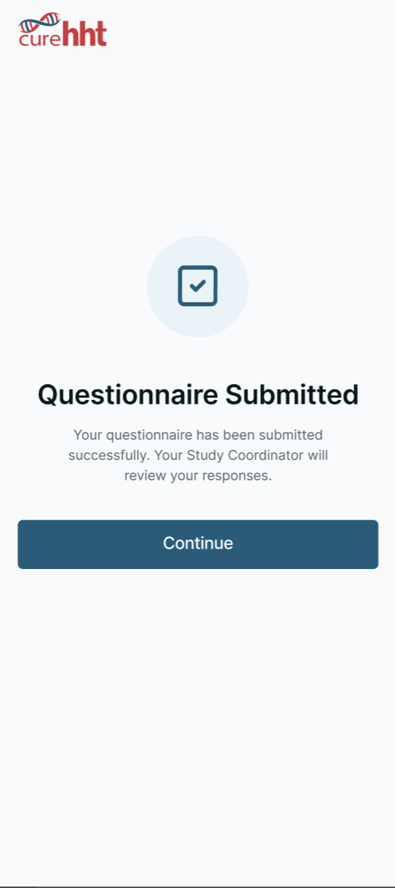
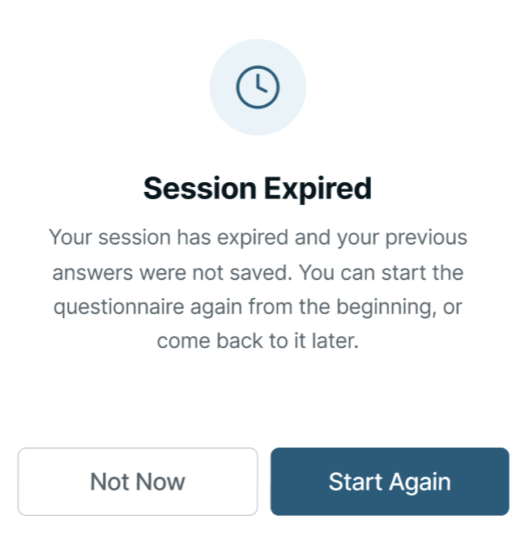
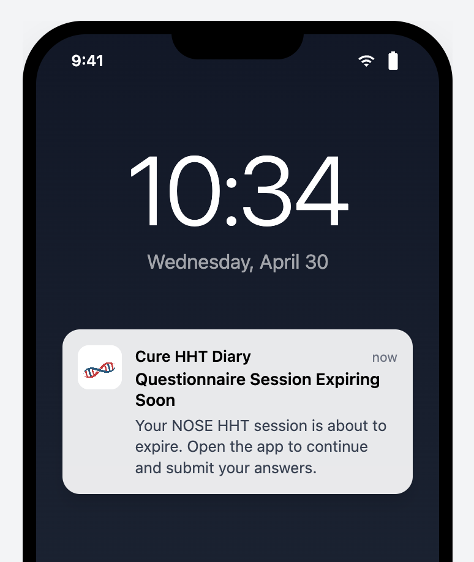
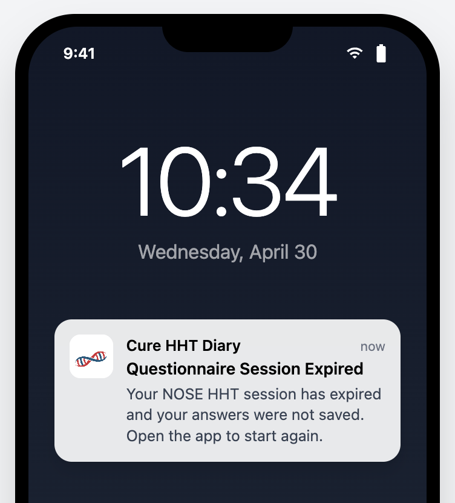

# *Participant* *Questionnaire* Workflow

The *Participant*-facing workflow over **Assigned Questionnaires** comprises the rules that govern how a *Participant* moves through *Preamble*, questions, Review, and *Submission*, the corresponding interface behavior, and the *Session* Timeout / *Session* Expiry mechanism that bounds how long an in-progress *Questionnaire* can be left idle.

## DIARY-PRD-questionnaire-portal-sent-rules: Assigned Questionnaire Rules

**Level**: PRD | **Status**: Draft | **Implements**: -
**Refines**: DIARY-BASE-questionnaires

### Overview

**Assigned Questionnaires** are initiated by a **Study Coordinator** from the **Sponsor Portal** and delivered to the *Participant* via push notification. The rules below define what the *Participant* sees (*Preamble*), how they progress through the *Questionnaire*, when their answers become a *Submission*, and the editing window between *Submission* and *Finalization*.

Assigned Questionnaire
: A Questionnaire initiated by a Study Coordinator from the Sponsor Portal and delivered to the participant via push notification.

Preamble
: The introductory content block presented to the participant before questionnaire questions begin informing the participant of the estimated completion time and that answers will not be saved until Submission.

Submission
: The participant action that signals all questions are answered and the Questionnaire is ready for Study Coordinator review.

Finalization
: The Study Coordinator action that permanently locks participant answers, triggers score calculation and pushes the data to Rave EDC.

### Assertions

**Preamble**

A. The System SHALL present the **Preamble** to the *Participant* each time the *Participant* opens an **Assigned Questionnaire**.

B. The **Preamble** SHALL inform the *Participant* of the estimated time required to complete the *Questionnaire*.

C. The **Preamble** SHALL inform the *Participant* that their progress will be retained while completing the *Questionnaire* and that answers are submitted only when they complete **Submission**.

D. The System SHALL require the *Participant* to confirm readiness before proceeding from the **Preamble** to the questions.

E. When the *Participant* indicates they are not ready, the System SHALL return the *Participant* to the Main home screen.

**Completion Rules**

F. The System SHALL present one question at a time during **Assigned Questionnaire** completion.

G. The System SHALL NOT permit the *Participant* to skip any question in an **Assigned Questionnaire**.

H. The System SHALL preserve in-progress answers locally while the *Participant* is completing the *Questionnaire* and SHALL NOT commit answers as a *Submission* until the *Participant* completes **Submission**.

I. The System SHALL make completion progress available to the *Participant* throughout the *Questionnaire*.

J. The System SHALL allow the *Participant* to navigate back and forth between the questions before **Submission**.

K. The System SHALL allow the *Participant* to exit the *Questionnaire* at any point before **Submission** without losing in-progress answers, subject to the **Session Timeout** defined in *Diary*-PRD-*Questionnaire*-*Session*-timeout.

L. The System SHALL present a review of all answers to the *Participant* before **Submission**, allowing the *Participant* to modify any answer before proceeding.

**Submission**

M. The System SHALL require an explicit *Participant* *Action* - clicking the Submit button - to complete **Submission**.

**Edit Rules**

N. The System SHALL allow the *Participant* to edit their answers with no time limit after **Submission** until **Finalization**.

O. The System SHALL NOT permit the *Participant* to edit their answers after **Finalization**.

### Rationale

The *Preamble* exists because an **Assigned Questionnaire** is a non-trivial commitment of *Participant* time (the *NOSE HHT* has 29 questions; an ad-hoc *Questionnaire* can be longer); telling the *Participant* up front how long it will take and that progress is preserved between sessions reduces the rate at which participants start and abandon mid-flow. One-question-at-a-time presentation matches the validated-instrument format (the source documents present questions one at a time on paper) and prevents the *Participant* from scanning ahead, which could bias later answers. Skipping is prohibited because the validated scoring algorithms require complete responses; partial questionnaires are not interpretable. The in-progress-preservation rule is the *Participant*-side guarantee that "Exit" is safe — combined with the **Session Timeout** override (which can discard in-progress answers if the *Participant* has been idle too long), it gives the *Participant* flexible but bounded continuation. Editing is open between *Submission* and *Finalization* because *Submission* signals "*Participant* is done", but the **Study Coordinator** review may surface answer issues the *Participant* should be able to correct without resubmitting from scratch; *Finalization* is the irreversible boundary because that is when the score is computed and the data ships to **Rave EDC**.

### Screen reference

See: 

*End* *Assigned Questionnaire Rules* | **Hash**: 3f1a10dd

## DIARY-GUI-questionnaire-portal-sent-workflow: Assigned Questionnaire Workflow

**Level**: GUI | **Status**: Draft | **Implements**: -
**Refines**: DIARY-PRD-questionnaire-portal-sent-rules

### Overview

The interface for an **Assigned Questionnaire** spans four screens: the **Preamble**, the per-question screen, the **Review Screen** (after the final question), and the post-*Submission* Acknowledgement Dialog. The behavior on each screen tracks the PRD-level rules above and adds the visual affordances (*Progress Indicator*, navigation controls, *Action* labels) participants use to move through the flow.

Review Screen
: The screen presented to the participant after answering the final question, displaying all questions and selected answers before Submission.

### Assertions

**Preamble**

A. The interface SHALL present the **Preamble** with two actions: an I'm Ready button and a Not Now button.

B. When the *Participant* selects Not Now, the interface SHALL navigate the *Participant* to the home screen.

C. When the *Participant* selects I'm Ready, the interface SHALL navigate the *Participant* to the first question.

**Question Screen**

D. The interface SHALL present a *Progress Indicator* showing the *Participant*'s current position within the *Questionnaire* (Question #X out of Y).

E. The interface SHALL display the *Questionnaire* Display Name as the screen title on every question screen.

F. The interface SHALL present a back navigation control on every question screen.

G. The interface SHALL present a Next *Action* on every question screen.

H. The Next *Action* SHALL be disabled until the *Participant* selects an answer.

I. When the *Participant* selects an answer and selects Next, the interface SHALL advance to the next question.

J. When the *Participant* navigates back to a previously answered question, the interface SHALL display the previously selected answer.

**Review Screen**

K. After the *Participant* answers the final question, the interface SHALL present the **Review Screen**.

L. The **Review Screen** SHALL present all questions and the *Participant*'s selected answers.

M. The **Review Screen** SHALL allow the *Participant* to navigate to any individual question to change their answer.

N. The **Review Screen** SHALL present a submit *Action*.

**Editing an Answer**

O. When the *Participant* navigates to an individual question from the **Review Screen** and changes an answer, the interface SHALL present a Save button.

P. When the *Participant* selects Save, the interface SHALL return the *Participant* to the **Review Screen**.

**Submission**

Q. When the *Participant* confirms **Submission**, the interface SHALL display an Acknowledgement Dialog confirming the *Questionnaire* has been submitted successfully.

**Post-Submission Editing**

R. When the *Participant* re-opens a submitted *Questionnaire* before **Finalization**, the interface SHALL present the **Review Screen**.

**Finalization**

S. When the *Participant* opens a finalized *Questionnaire*, the interface SHALL present the *Questionnaire* in a read-only state with no edit or submit actions available.

### Rationale

The four-screen structure (*Preamble*, Question, Review, Acknowledgement) makes the *Questionnaire*'s logical structure visible to the *Participant*: a clearly demarcated start (*Preamble* with I'm Ready / Not Now), per-question progress visibility (Question #X out of Y title), a final aggregated review before commit (*Review Screen* with per-question edit affordance), and an explicit confirmation that the *Submission* landed (post-*Submission* Acknowledgement Dialog). The Next-disabled-until-answered rule combined with the prohibition on skipping is how the platform enforces the no-skipped-questions PRD assertion at the GUI layer. Returning to the **Review Screen** on re-open between *Submission* and *Finalization* keeps the *Participant*'s mental model aligned with the PRD-level edit window — they always re-enter through the aggregated review, not into a partial-flow ambiguity, so the next *Action* is either "Submit again" or "I'm finished, close this". The read-only state after *Finalization* is the GUI-side counterpart of the PRD-level "no edit after *Finalization*" rule.

> **Follow-up — configurability**: This requirement currently encodes
> the only option implemented in code. Future sponsors may require
> different rules; introduce a configurable seam (e.g. a parameter on
> the *Sponsor*-overlay parent, or a new platform-side template the
> *Sponsor*-overlay REQ Satisfies) when the need arises. Until that seam
> exists, this REQ is normative for the current deployment.

### Screen reference

See:

*End* *Assigned Questionnaire Workflow* | **Hash**: ca0d5613

## DIARY-PRD-questionnaire-session-timeout: Questionnaire Session Timeout

**Level**: PRD | **Status**: Draft | **Implements**: -
**Refines**: DIARY-PRD-questionnaire-portal-sent-rules

### Overview

A configurable *Session* timeout allows each *Questionnaire* to enforce appropriate completion constraints based on its length and clinical requirements.

Session Timeout
: The configurable maximum duration of inactivity allowed during questionnaire completion. When exceeded, the session expires and the answers selected so far are not retained.

Session Expiry
: The state reached when a participant has not completed a questionnaire within the configured Session Timeout duration.

Timeout Warning Notification
: Push notification delivered to the participant when the Session Timeout is approaching.

Session Expiry Notification
: Push notification delivered to the participant when Session Expiry has occurred.

### Assertions

**Timeout Tracking**

A. When a *Questionnaire* is configured with a **Session Timeout**, the System SHALL track elapsed inactivity from the *Participant*'s most recent interaction with the *Questionnaire*.

B. The System SHALL only advance the inactivity timer while the *Participant* is not actively interacting with the *Questionnaire*.

C. When the **Session Timeout** is exceeded before the *Participant* submits the *Questionnaire*, the System SHALL discard all answers selected so far.

**Expiry Behavior**

D. When a *Participant* returns to a *Questionnaire* in a state of **Session Expiry**, the System SHALL present the *Questionnaire* from the beginning including the **Preamble**.

**Notifications**

E. When a *Questionnaire* is configured with a **Session Timeout**, the System SHALL deliver a **Timeout Warning Notification** to the *Participant* when the **Session Timeout** is approaching.

F. When a *Questionnaire* is configured with a **Session Timeout**, the System SHALL deliver a **Session Expiry Notification** to the *Participant* when **Session Expiry** has occurred.

**State Preservation**

G. When a *Questionnaire* is not configured with a **Session Timeout**, the System SHALL preserve and restore the *Participant*'s in-progress answers on return with no timeout constraint.

H. When a *Questionnaire* with a **Session Timeout** has not yet expired, the System SHALL return the *Participant* to their in-progress *Questionnaire* on return.

**Configuration**

I. Each *Questionnaire* definition SHALL support optional configuration of **Session Timeout** duration.

J. Each *Questionnaire* definition SHALL support configuration of the threshold before expiry at which the **Timeout Warning Notification** is delivered.

### Rationale

Some questionnaires (e.g. the *NOSE HHT*, the *HHT-QoL*) require contemporaneous answering — a *Participant*'s frame of reference shifts measurably if they pause for hours between questions, and the resulting answers no longer reflect a single moment of self-report. A configurable **Session Timeout** lets each *Questionnaire* enforce a "complete this in one sitting" constraint without baking a single duration into the platform. Discarding in-progress answers on expiry rather than retaining them is what gives the timeout its clinical meaning: the next attempt starts fresh from the **Preamble**, with a *Participant* frame of reference that the *Sponsor* can interpret. The opt-out (no **Session Timeout** configured) covers the case where in-progress preservation is fine (e.g. an ad-hoc *Questionnaire* with no contemporaneous requirement). The two notifications — Warning before expiry, Expiry on the event — give the *Participant* a chance to return before answers are discarded (Warning) and clear feedback when answers have already been discarded (Expiry).

### Screen reference

See:

*End* *Questionnaire Session Timeout* | **Hash**: 4e7f3306

## DIARY-GUI-questionnaire-session-expiry: Questionnaire Session Expiry

**Level**: GUI | **Status**: Draft | **Implements**: -
**Refines**: DIARY-PRD-questionnaire-session-timeout

### Overview

The interface for **Session Expiry** consists of three surfaces: the **Timeout Warning Notification** (push notification before expiry), the **Session Expiry Dialog** (in-app dialog on return after expiry), and the **Session Expiry Notification** (push notification when expiry occurs). On return to an active (not-yet-expired) *Session*, the interface restores the *Participant* to where they left off.

Session Expiry Dialog
: The Acknowledgement Dialog displayed to the participant when they open a questionnaire that has reached Session Expiry.

### Assertions

**Timeout Warning**

A. When a **Timeout Warning Notification** is delivered, the interface SHALL present it as a push notification indicating that the *Questionnaire* *Session* is approaching expiry.

**Expired Session on Return**

B. When the *Participant* opens a *Questionnaire* that has reached **Session Expiry**, the interface SHALL display a **Session Expiry Dialog** informing the *Participant* that their *Session* has expired and their previous answers were not saved.

C. The **Session Expiry Dialog** SHALL present a Start Again button and a Not Now button.

D. When the *Participant* selects Start Again, the interface SHALL dismiss the **Session Expiry Dialog** and present the **Preamble**.

E. When the *Participant* selects Not Now, the interface SHALL navigate the *Participant* to the home screen.

**Session Expiry Notification**

F. When a **Session Expiry Notification** is delivered, the interface SHALL present it as a push notification indicating that the *Questionnaire* *Session* has expired.

**Active Session on Return**

G. When the *Participant* returns to a *Questionnaire* with a *Session* that has not yet reached **Session Expiry**, the interface SHALL restore the *Participant* to the question they were on when they left, with their in-progress answers intact.

### Rationale

The **Session Expiry Dialog** is the in-app companion to the **Session Expiry Notification**: the notification tells the *Participant* the *Session* expired while they were away from the app; the dialog confirms it when they return and tells them their prior answers are gone. Start Again / Not Now are the two realistic next-actions — restart now from the *Preamble*, or defer until later — and both are made explicit so the *Participant* does not face a silent reset on next open. Restoring the active-*Session* *Participant* to their last question (with in-progress answers intact) is the GUI-side guarantee that the PRD's in-progress-preservation rule actually surfaces to the *Participant*; if the interface always re-entered through the *Preamble*, the preservation would be invisible and the *Participant* would lose confidence that pausing is safe.

> **Follow-up — configurability**: This requirement currently encodes
> the only option implemented in code. Future sponsors may require
> different rules; introduce a configurable seam (e.g. a parameter on
> the *Sponsor*-overlay parent, or a new platform-side template the
> *Sponsor*-overlay REQ Satisfies) when the need arises. Until that seam
> exists, this REQ is normative for the current deployment.

### Screen reference

See: 

*End* *Questionnaire Session Expiry* | **Hash**: 02879dd5
