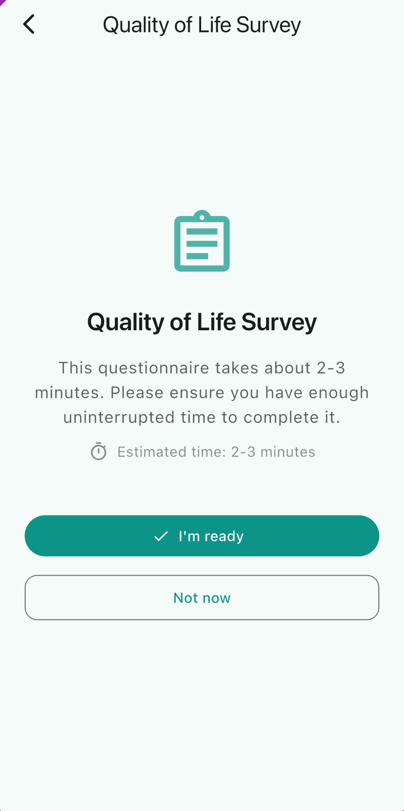
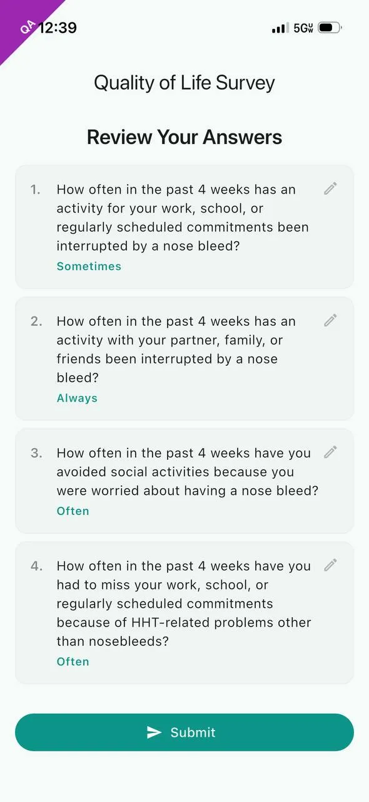
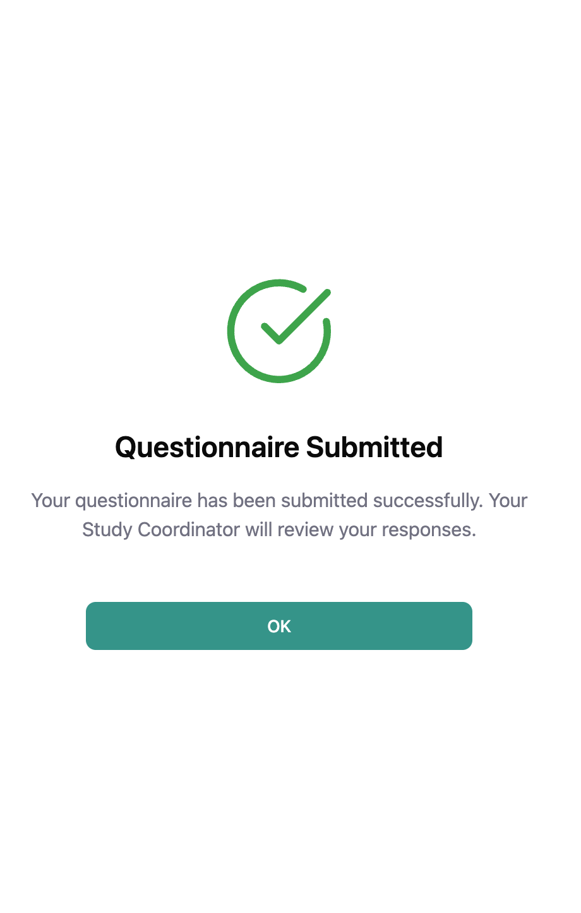
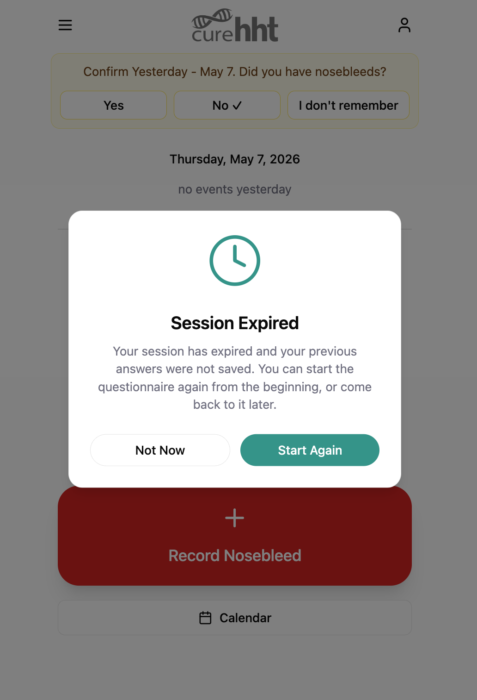

# Participant Questionnaire Workflow

This file defines the participant-facing workflow over **Portal-Sent Questionnaires** — the rules that govern how a participant moves through Preamble, questions, Review, and Submission, the corresponding interface behavior, and the Session Timeout / Session Expiry mechanism that bounds how long an in-progress questionnaire can be left idle. The instruments these workflows operate over are defined in `prd-questionnaire-overview.md`. The sponsor-side call-back behavior overlay (`CAL-GUI-questionnaire-call-back-participant`) lives in the `hht_diary_callisto` repo.

## DIARY-PRD-questionnaire-portal-sent-rules: Portal-Sent Questionnaire Rules

**Level**: prd | **Status**: Legacy | **Implements**: -

### Overview

**Portal-Sent Questionnaires** are initiated by a **Study Coordinator** from the **Sponsor Portal** and delivered to the participant via push notification. The rules below define what the participant sees (Preamble), how they progress through the questionnaire, when their answers become a Submission, and the editing window between Submission and Finalization.

### Definitions

**Portal-Sent Questionnaire**: A Questionnaire initiated by a Study Coordinator from the Sponsor Portal and delivered to the participant via push notification.

**Preamble**: The introductory content block presented to the participant before questionnaire questions begin informing the participant of the estimated completion time and that answers will not be saved until Submission.

**Submission**: The participant action that signals all questions are answered and the Questionnaire is ready for Study Coordinator review.

**Finalization**: The Study Coordinator action that permanently locks participant answers, triggers score calculation and pushes the data to Rave EDC.

### Assertions

**Preamble**

A. The System SHALL present the **Preamble** to the participant each time the participant opens a **Portal-Sent Questionnaire**.

B. The **Preamble** SHALL inform the participant of the estimated time required to complete the questionnaire.

C. The **Preamble** SHALL inform the participant that their progress will be retained while completing the questionnaire and that answers are submitted only when they complete **Submission**.

D. The System SHALL require the participant to confirm readiness before proceeding from the **Preamble** to the questions.

E. When the participant indicates they are not ready, the System SHALL return the participant to the Main home screen.

**Completion Rules**

F. The System SHALL present one question at a time during **Portal-Sent Questionnaire** completion.

G. The System SHALL NOT permit the participant to skip any question in a **Portal-Sent Questionnaire**.

H. The System SHALL preserve in-progress answers locally while the participant is completing the questionnaire and SHALL NOT commit answers as a Submission until the participant completes **Submission**.

I. The System SHALL make completion progress available to the participant throughout the questionnaire.

J. The System SHALL allow the participant to navigate back and forth between the questions before **Submission**.

K. The System SHALL allow the participant to exit the questionnaire at any point before **Submission** without losing in-progress answers, subject to the **Session Timeout** defined in DIARY-PRD-questionnaire-session-timeout.

L. The System SHALL present a review of all answers to the participant before **Submission**, allowing the participant to modify any answer before proceeding.

**Submission**

M. The System SHALL require an explicit participant action - clicking the Submit button - to complete **Submission**.

**Edit Rules**

N. The System SHALL allow the participant to edit their answers with no time limit after **Submission** until **Finalization**.

O. The System SHALL NOT permit the participant to edit their answers after **Finalization**.

### Rationale

The Preamble exists because a **Portal-Sent Questionnaire** is a non-trivial commitment of participant time (the NOSE HHT has 29 questions; an ad-hoc questionnaire can be longer); telling the participant up front how long it will take and that progress is preserved between sessions reduces the rate at which participants start and abandon mid-flow. One-question-at-a-time presentation matches the validated-instrument format (the source documents present questions one at a time on paper) and prevents the participant from scanning ahead, which could bias later answers. Skipping is prohibited because the validated scoring algorithms require complete responses; partial questionnaires are not interpretable. The in-progress-preservation rule is the participant-side guarantee that "Exit" is safe — combined with the **Session Timeout** override (which can discard in-progress answers if the participant has been idle too long), it gives the participant flexible but bounded continuation. Editing is open between Submission and Finalization because Submission signals "participant is done", but the **Study Coordinator** review may surface answer issues the participant should be able to correct without resubmitting from scratch; Finalization is the irreversible boundary because that is when the score is computed and the data ships to **Rave EDC**.

### Screen reference

See: 

*End* *Portal-Sent Questionnaire Rules* | **Hash**: aff8012d

## DIARY-GUI-questionnaire-portal-sent-workflow: Portal-Sent Questionnaire Workflow

**Level**: GUI | **Status**: Legacy | **Implements**: -
**Refines**: DIARY-PRD-questionnaire-portal-sent-rules

### Overview

The interface for a **Portal-Sent Questionnaire** spans four screens: the **Preamble**, the per-question screen, the **Review Screen** (after the final question), and the post-Submission Acknowledgement Dialog. The behavior on each screen tracks the PRD-level rules above and adds the visual affordances (progress indicator, navigation controls, action labels) participants use to move through the flow.

### Definitions

**Review Screen**: The screen presented to the participant after answering the final question, displaying all questions and selected answers before Submission.

### Assertions

**Preamble**

A. The interface SHALL present the **Preamble** with two actions: an I'm Ready button and a Not Now button.

B. When the participant selects Not Now, the interface SHALL navigate the participant to the home screen.

C. When the participant selects I'm Ready, the interface SHALL navigate the participant to the first question.

**Question Screen**

D. The interface SHALL present a progress indicator showing the participant's current position within the questionnaire (Question #X out of Y).

E. The interface SHALL display the Questionnaire Display Name as the screen title on every question screen.

F. The interface SHALL present a back navigation control on every question screen.

G. The interface SHALL present a Next action on every question screen.

H. The Next action SHALL be disabled until the participant selects an answer.

I. When the participant selects an answer and selects Next, the interface SHALL advance to the next question.

J. When the participant navigates back to a previously answered question, the interface SHALL display the previously selected answer.

**Review Screen**

K. After the participant answers the final question, the interface SHALL present the **Review Screen**.

L. The **Review Screen** SHALL present all questions and the participant's selected answers.

M. The **Review Screen** SHALL allow the participant to navigate to any individual question to change their answer.

N. The **Review Screen** SHALL present a submit action.

**Editing an Answer**

O. When the participant navigates to an individual question from the **Review Screen** and changes an answer, the interface SHALL present a Save button.

P. When the participant selects Save, the interface SHALL return the participant to the **Review Screen**.

**Submission**

Q. When the participant confirms **Submission**, the interface SHALL display an Acknowledgement Dialog confirming the questionnaire has been submitted successfully.

**Post-Submission Editing**

R. When the participant re-opens a submitted questionnaire before **Finalization**, the interface SHALL present the **Review Screen**.

**Finalization**

S. When the participant opens a finalized questionnaire, the interface SHALL present the questionnaire in a read-only state with no edit or submit actions available.

### Rationale

The four-screen structure (Preamble, Question, Review, Acknowledgement) makes the questionnaire's logical structure visible to the participant: a clearly demarcated start (Preamble with I'm Ready / Not Now), per-question progress visibility (Question #X out of Y title), a final aggregated review before commit (Review Screen with per-question edit affordance), and an explicit confirmation that the submission landed (post-Submission Acknowledgement Dialog). The Next-disabled-until-answered rule combined with the prohibition on skipping is how the platform enforces the no-skipped-questions PRD assertion at the GUI layer. Returning to the **Review Screen** on re-open between Submission and Finalization keeps the participant's mental model aligned with the PRD-level edit window — they always re-enter through the aggregated review, not into a partial-flow ambiguity, so the next action is either "Submit again" or "I'm finished, close this". The read-only state after Finalization is the GUI-side counterpart of the PRD-level "no edit after Finalization" rule.

> **Follow-up — configurability**: This requirement currently encodes
> the only option implemented in code. Future sponsors may require
> different rules; introduce a configurable seam (e.g. a parameter on
> the CAL-PRD-* parent, or a new platform-side template the CAL- REQ
> Satisfies) when the need arises. Until that seam exists, this REQ is
> normative for the Callisto deployment.

### Screen reference

See:

*End* *Portal-Sent Questionnaire Workflow* | **Hash**: 34a7c378

## DIARY-PRD-questionnaire-session-timeout: Questionnaire Session Timeout

**Level**: prd | **Status**: Legacy | **Implements**: -
**Refines**: DIARY-PRD-questionnaire-portal-sent-rules

### Overview

A configurable session timeout allows each questionnaire to enforce appropriate completion constraints based on its length and clinical requirements.

### Definitions

**Session Timeout**: The configurable maximum duration of inactivity allowed during questionnaire completion. When exceeded, the session expires and the answers selected so far are not retained.

**Session Expiry**: The state reached when a participant has not completed a questionnaire within the configured Session Timeout duration.

**Timeout Warning Notification**: Push notification delivered to the participant when the Session Timeout is approaching.

**Session Expiry Notification**: Push notification delivered to the participant when Session Expiry has occurred.

### Assertions

**Timeout Tracking**

A. When a questionnaire is configured with a **Session Timeout**, the System SHALL track elapsed inactivity from the participant's most recent interaction with the questionnaire.

B. The System SHALL only advance the inactivity timer while the participant is not actively interacting with the questionnaire.

C. When the **Session Timeout** is exceeded before the participant submits the questionnaire, the System SHALL discard all answers selected so far.

**Expiry Behavior**

D. When a participant returns to a questionnaire in a state of **Session Expiry**, the System SHALL present the questionnaire from the beginning including the **Preamble**.

**Notifications**

E. When a questionnaire is configured with a **Session Timeout**, the System SHALL deliver a **Timeout Warning Notification** to the participant when the **Session Timeout** is approaching.

F. When a questionnaire is configured with a **Session Timeout**, the System SHALL deliver a **Session Expiry Notification** to the participant when **Session Expiry** has occurred.

**State Preservation**

G. When a questionnaire is not configured with a **Session Timeout**, the System SHALL preserve and restore the participant's in-progress answers on return with no timeout constraint.

H. When a questionnaire with a **Session Timeout** has not yet expired, the System SHALL return the participant to their in-progress questionnaire on return.

**Configuration**

I. Each questionnaire definition SHALL support optional configuration of **Session Timeout** duration.

J. Each questionnaire definition SHALL support configuration of the threshold before expiry at which the **Timeout Warning Notification** is delivered.

### Rationale

Some clinical questionnaires (e.g. the NOSE HHT, the HHT-QoL) require contemporaneous answering — a participant's frame of reference shifts measurably if they pause for hours between questions, and the resulting answers no longer reflect a single moment of self-report. A configurable **Session Timeout** lets each questionnaire enforce a "complete this in one sitting" constraint without baking a single duration into the platform. Discarding in-progress answers on expiry rather than retaining them is what gives the timeout its clinical meaning: the next attempt starts fresh from the **Preamble**, with a participant frame of reference that the sponsor can interpret. The opt-out (no **Session Timeout** configured) covers the case where in-progress preservation is fine (e.g. an ad-hoc questionnaire with no contemporaneous requirement). The two notifications — Warning before expiry, Expiry on the event — give the participant a chance to return before answers are discarded (Warning) and clear feedback when answers have already been discarded (Expiry).

### Screen reference

See:

*End* *Questionnaire Session Timeout* | **Hash**: 88870c17

## DIARY-GUI-questionnaire-session-expiry: Questionnaire Session Expiry

**Level**: GUI | **Status**: Legacy | **Implements**: -
**Refines**: DIARY-PRD-questionnaire-session-timeout

### Overview

The interface for **Session Expiry** consists of three surfaces: the **Timeout Warning Notification** (push notification before expiry), the **Session Expiry Dialog** (in-app dialog on return after expiry), and the **Session Expiry Notification** (push notification when expiry occurs). On return to an active (not-yet-expired) session, the interface restores the participant to where they left off.

### Definitions

**Session Expiry Dialog**: The Acknowledgement Dialog displayed to the participant when they open a questionnaire that has reached Session Expiry.

### Assertions

**Timeout Warning**

A. When a **Timeout Warning Notification** is delivered, the interface SHALL present it as a push notification indicating that the questionnaire session is approaching expiry.

**Expired Session on Return**

B. When the participant opens a questionnaire that has reached **Session Expiry**, the interface SHALL display a **Session Expiry Dialog** informing the participant that their session has expired and their previous answers were not saved.

C. The **Session Expiry Dialog** SHALL present a Start Again button and a Not Now button.

D. When the participant selects Start Again, the interface SHALL dismiss the **Session Expiry Dialog** and present the **Preamble**.

E. When the participant selects Not Now, the interface SHALL navigate the participant to the home screen.

**Session Expiry Notification**

F. When a **Session Expiry Notification** is delivered, the interface SHALL present it as a push notification indicating that the questionnaire session has expired.

**Active Session on Return**

G. When the participant returns to a questionnaire with a session that has not yet reached **Session Expiry**, the interface SHALL restore the participant to the question they were on when they left, with their in-progress answers intact.

### Rationale

The **Session Expiry Dialog** is the in-app companion to the **Session Expiry Notification**: the notification tells the participant the session expired while they were away from the app; the dialog confirms it when they return and tells them their prior answers are gone. Start Again / Not Now are the two realistic next-actions — restart now from the Preamble, or defer until later — and both are made explicit so the participant does not face a silent reset on next open. Restoring the active-session participant to their last question (with in-progress answers intact) is the GUI-side guarantee that the PRD's in-progress-preservation rule actually surfaces to the participant; if the interface always re-entered through the Preamble, the preservation would be invisible and the participant would lose confidence that pausing is safe.

> **Follow-up — configurability**: This requirement currently encodes
> the only option implemented in code. Future sponsors may require
> different rules; introduce a configurable seam (e.g. a parameter on
> the CAL-PRD-* parent, or a new platform-side template the CAL- REQ
> Satisfies) when the need arises. Until that seam exists, this REQ is
> normative for the Callisto deployment.

### Screen reference

See: 

*End* *Questionnaire Session Expiry* | **Hash**: c596cbb7
