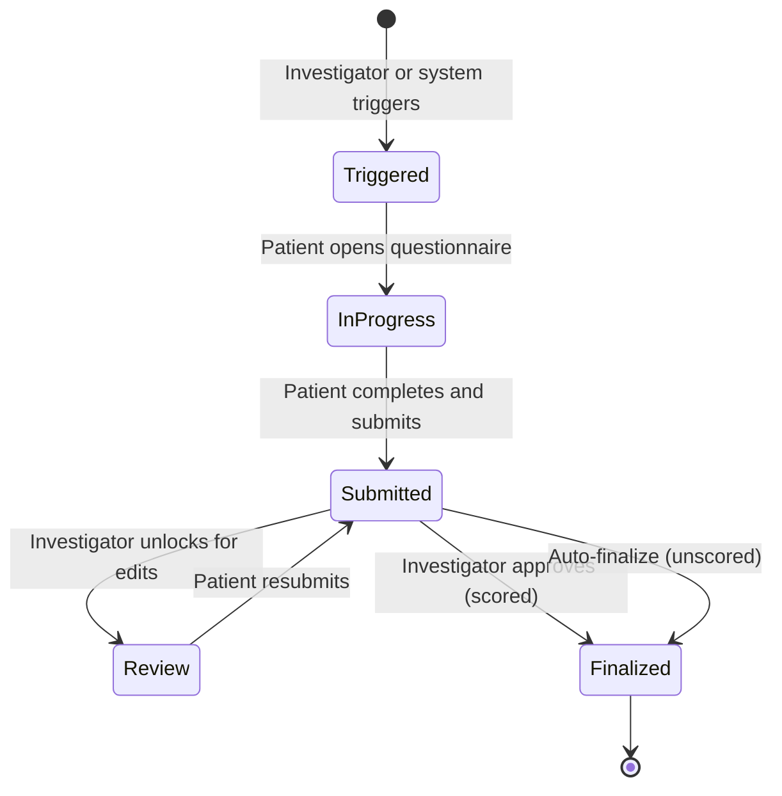

# Clinical Questionnaire System

**Version**: 1.0
**Status**: Draft
**Last Updated**: 2026-01-21

> **See**: prd-questionnaire-approval.md for investigator approval workflow (REQ-p01064)
> **See**: prd-event-sourcing-system.md for versioning model (REQ-p01051, REQ-p01052, REQ-p01053)

---

## Overview

This specification defines the Clinical Questionnaire System, a framework for implementing structured data collection instruments in the HHT Clinical Diary Platform. Questionnaires are individually coded Flutter components designed for high-quality user experience, not a generic form-builder system.

The system supports an extensible set of questionnaire types, each implemented through platform development rather than end-user configuration. New questionnaires may be added over time as sponsor requirements dictate.

---

## Questionnaire Model

A questionnaire in this system is:
- A **structured data collection instrument** with defined questions, response options, and scoring algorithms
- **Individually implemented** as custom Flutter components with optimized GUI/UX
- **Version-controlled** per the questionnaire versioning model (REQ-p01051)
- **Localizable** per the localization tracking model (REQ-p01052)
- **Sponsor-configurable** for trial eligibility (REQ-p01053)

Questionnaires are NOT:
- Dynamically definable by end users or third parties
- Generic forms rendered from configuration data
- Extensible without platform development

---

## Questionnaire Lifecycle

| Status | Description |
| ------ | ----------- |
| Triggered | Questionnaire requested, awaiting patient action |
| In Progress | Patient is actively completing the questionnaire |
| Submitted | Patient has submitted, awaiting investigator review (if scored) |
| Review | Investigator has unlocked for patient edits |
| Finalized | Permanently locked, score calculated (if applicable) |

---

## Questionnaire Categories

### Initial Set (First Sponsor)

| Questionnaire | Type | Scoring | Approval Required |
| ------------- | ---- | ------- | ----------------- |
| Daily Epistaxis Record | Self-report diary | No | Study Start only |
| NOSE HHT | Validated instrument | Yes | Yes |
| HHT Quality of Life | Validated instrument | Yes | Yes |

### Future Questionnaires

Additional questionnaires are added through platform development as sponsors require them. Each new questionnaire receives its own requirement specification and custom Flutter implementation.

---

## Study Start Workflow

The "Study Start" workflow gates patient enrollment in a clinical trial:

1. **Sponsor triggers** initial Study Start questionnaire (typically an epistaxis questionnaire)
2. **Patient completes** the questionnaire on their enrolled device
3. **Investigator reviews** and approves via the approval workflow (REQ-p01064)
4. **Study officially begins** upon investigator approval
5. **Data sync enabled** - patient data begins syncing to Sponsor Portal

Before Study Start approval:
- Patient data stored locally only
- No data synced to Portal or database
- Patient can continue using app but data remains local

After Study Start approval:
- Daily self-reported data syncs automatically
- No per-entry investigator approval required for ongoing records
- Scored questionnaires still require investigator approval before scoring

---

## Data Storage

All questionnaire data follows the event sourcing model:

- **Immutable events** capture each interaction (answer provided, submission, approval)
- **Audit trail** records all status transitions with timestamps and acting user
- **Version tracking** captures questionnaire definition version used for each response

---

## Requirements

# REQ-p01065: Clinical Questionnaire System

**Level**: PRD | **Status**: Draft | **Implements**: REQ-p00044

## Rationale

Clinical trials require structured data collection instruments that ensure data quality, regulatory compliance, and optimal patient experience. A coded implementation approach provides superior GUI/UX compared to generic form builders, allows questionnaire-specific optimizations, and maintains full control over data integrity. The extensible model allows new questionnaires to be added as sponsor needs evolve while maintaining consistent quality standards.

**Design Choice**: Questionnaires are not definable or configurable by third parties or end users. This ensures quality control and regulatory compliance.

## Assertions

A. The system SHALL support multiple questionnaire types, each implemented as individual coded components.

B. Each questionnaire SHALL be implemented as custom Flutter components with questionnaire-specific GUI/UX.

C. Each questionnaire SHALL have custom user interface optimized for its specific content and response types.

D. Questionnaires SHALL follow the versioning model defined in REQ-p01051.

E. Scored questionnaires SHALL support the investigator approval workflow defined in REQ-p01064.

F. Questionnaire data SHALL be stored as immutable events per the event sourcing model (REQ-p01003).

G. The system SHALL track completion status for each questionnaire instance.

H. The system SHALL support sponsor-configurable "Study Start" questionnaire that gates patient enrollment.

I. The system SHALL NOT sync patient data to the Sponsor Portal until the Study Start questionnaire has been approved by an investigator.

J. New questionnaire types SHALL be added through platform development, not through runtime configuration.

K. Sponsors SHALL configure which questionnaires are enabled for their trials per REQ-p01053.

*End* *Clinical Questionnaire System* | **Hash**: 284c999b
---

## Child Requirements

The following requirements specify individual questionnaires:

| ID | Questionnaire | File |
| --- | ------------- | ---- |
| REQ-p01066 | Daily Epistaxis Record | prd-questionnaire-epistaxis.md |
| REQ-p01067 | NOSE HHT | prd-questionnaire-nose-hht.md |
| REQ-p01068 | HHT Quality of Life | prd-questionnaire-qol.md |

---

## References

- **Approval Workflow**: prd-questionnaire-approval.md (REQ-p01064)
- **Versioning Model**: prd-event-sourcing-system.md (REQ-p01051)
- **Localization**: prd-event-sourcing-system.md (REQ-p01052)
- **Sponsor Configuration**: prd-event-sourcing-system.md (REQ-p01053)
- **Event Sourcing**: prd-database.md (REQ-p00004)
- **FDA Compliance**: prd-clinical-trials.md (REQ-p00010)
