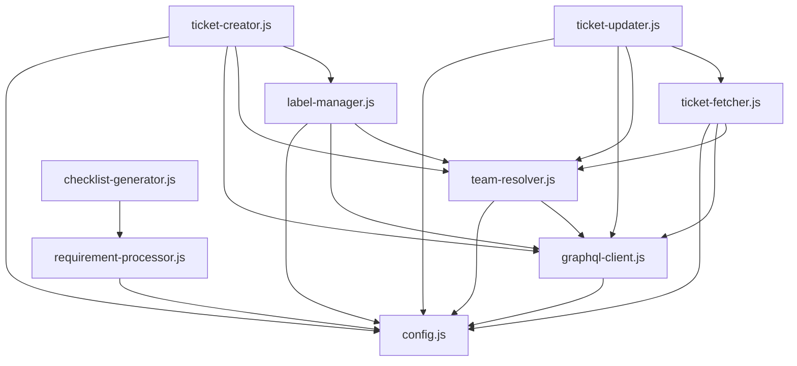

# Linear Integration Plugin Architecture

## Overview

This document defines the layered architecture for the Linear integration plugin, ensuring code reuse, no circular dependencies, and clear separation of concerns.

## Architectural Layers

### Layer 1: Core Infrastructure (Foundation)
The lowest level utilities that everything else depends on.

#### `lib/config.js` - Configuration Management
- **Purpose**: Single source of truth for all configuration
- **Responsibilities**:
  - Load config from multiple sources (env, files, args)
  - Save discovered configuration (team ID)
  - Provide paths and API endpoints
- **Dependencies**: None
- **Used by**: Everything

#### `lib/graphql-client.js` - GraphQL Communication
- **Purpose**: Centralized GraphQL request handling
- **Responsibilities**:
  - Execute GraphQL queries/mutations
  - Handle authentication headers
  - Consistent error handling and reporting
  - Response validation
- **Dependencies**: `config.js`
- **Used by**: All data-fetching modules

### Layer 2: Basic Data Fetchers
Simple data retrieval that other operations depend on.

#### `lib/team-resolver.js` - Team Resolution
- **Purpose**: Handle team ID discovery and caching
- **Responsibilities**:
  - Get current team ID (from config or discover)
  - Auto-discover teams from API
  - Save discovered team to config
  - List all available teams
- **Dependencies**: `config.js`, `graphql-client.js`
- **Used by**: All operations requiring team context

#### `lib/label-manager.js` - Label Management
- **Purpose**: Handle all label-related operations
- **Responsibilities**:
  - Fetch all labels for team
  - Search/filter labels
  - Map label names to IDs
  - Cache labels for session
- **Dependencies**: `config.js`, `graphql-client.js`, `team-resolver.js`
- **Used by**: Ticket creation/update operations

### Layer 3: Core Operations
Primary Linear operations using lower layers.

#### `lib/ticket-fetcher.js` - Ticket Read Operations
- **Purpose**: All ticket retrieval operations
- **Responsibilities**:
  - Fetch assigned tickets
  - Search tickets by query
  - Get tickets by label
  - Get ticket details by ID
- **Dependencies**: `config.js`, `graphql-client.js`, `team-resolver.js`
- **Used by**: Update operations, user-facing scripts

#### `lib/ticket-creator.js` - Ticket Creation
- **Purpose**: Create Linear tickets
- **Responsibilities**:
  - Create single ticket with labels
  - Validate required fields
  - Handle priority levels
  - Return created ticket info
- **Dependencies**: `config.js`, `graphql-client.js`, `team-resolver.js`, `label-manager.js`
- **Used by**: Creation scripts, requirement ticket generator

#### `lib/ticket-updater.js` - Ticket Updates
- **Purpose**: Modify existing tickets
- **Responsibilities**:
  - Update ticket description
  - Add/modify checklists
  - Change status
  - Link requirements
- **Dependencies**: `config.js`, `graphql-client.js`, `team-resolver.js`, `ticket-fetcher.js`
- **Used by**: Update scripts, checklist generators

### Layer 4: Complex Operations
Higher-level operations that combine multiple lower-level operations.

#### `lib/requirement-processor.js` - Requirement Processing
- **Purpose**: Parse and process requirements from spec files
- **Responsibilities**:
  - Find requirements in spec files
  - Parse requirement content
  - Find sub-requirements
  - Extract requirement metadata
- **Dependencies**: `config.js` (for paths)
- **Used by**: Checklist generator, requirement ticket creator

#### `lib/checklist-generator.js` - Checklist Generation
- **Purpose**: Generate checklists from various sources
- **Responsibilities**:
  - Parse requirement content for tasks
  - Generate subsystem-specific tasks
  - Format checklists in markdown
  - Combine multiple checklist sources
- **Dependencies**: `requirement-processor.js`
- **Used by**: Add-checklist scripts

### Layer 5: User-Facing Scripts
Thin wrappers that compose helpers to perform user tasks.

```
scripts/
├── initialize.js           → uses team-resolver
├── list-labels.js          → uses label-manager
├── fetch-tickets.js        → uses ticket-fetcher
├── search-tickets.js       → uses ticket-fetcher
├── create-single-ticket.js → uses ticket-creator
├── update-ticket.js        → uses ticket-updater
├── add-requirement-checklist.js → uses ticket-fetcher, ticket-updater, requirement-processor, checklist-generator
└── create-requirement-tickets.js → uses requirement-processor, ticket-creator
```

## Dependency Flow (No Circular Dependencies)



## Implementation Guidelines

### 1. Error Handling
- All helpers should throw meaningful errors
- GraphQL errors should be parsed and made readable
- Network errors should suggest troubleshooting steps

### 2. Caching
- Labels should be cached per session
- Team ID should be persisted once discovered
- Avoid redundant API calls

### 3. Configuration
- All configuration through `config.js`
- No hardcoded values in scripts
- Support multiple configuration sources

### 4. Logging
- Consistent logging format
- Use symbols: ✅ success, ❌ error, ⚠️ warning, 🔍 searching, 📋 info
- Progress indicators for long operations

## Migration Plan

### Phase 1: Core Infrastructure
1. Fix `config.js` to properly save/load team ID
2. Create `graphql-client.js` with consistent error handling
3. Test both modules thoroughly

### Phase 2: Basic Fetchers
1. Create `team-resolver.js` using existing team discovery code
2. Create `label-manager.js` extracting from existing scripts
3. Update `config.js` to use `team-resolver.js`

### Phase 3: Core Operations
1. Extract ticket fetching logic to `ticket-fetcher.js`
2. Extract ticket creation to `ticket-creator.js`
3. Extract ticket updates to `ticket-updater.js`

### Phase 4: Complex Operations
1. Create `requirement-processor.js` from existing requirement code
2. Create `checklist-generator.js` from existing checklist code

### Phase 5: Script Refactoring
1. Update each script to use appropriate helpers
2. Remove duplicate code
3. Ensure backward compatibility

### Phase 6: Documentation
1. Update skill documentation to reflect actual implementation
2. Add JSDoc comments to all helpers
3. Create usage examples

## Benefits

1. **No Code Duplication**: Each piece of logic exists in exactly one place
2. **Testable**: Small, focused modules are easier to test
3. **Maintainable**: Clear dependencies and responsibilities
4. **Extensible**: New features can easily use existing helpers
5. **Consistent**: All operations behave the same way
6. **Efficient**: Shared caching and config reduces API calls

## Example Usage

```javascript
// Script: create-single-ticket.js
const ticketCreator = require('./lib/ticket-creator');
const args = require('./lib/args-parser').parse(process.argv);

async function main() {
    try {
        const ticket = await ticketCreator.create({
            title: args.title,
            description: args.description,
            labels: args.labels,
            priority: args.priority
        });
        console.log(`✅ Created ticket: ${ticket.identifier}`);
    } catch (error) {
        console.error(`❌ ${error.message}`);
        process.exit(1);
    }
}

main();
```

## Testing Strategy

Each helper module should have:
1. Unit tests for core functionality
2. Integration tests with mocked GraphQL
3. Error case coverage
4. Documentation examples that work

## Security Considerations

1. Never log full API tokens
2. Sanitize error messages before displaying
3. Validate all inputs
4. Use secure storage for tokens (not plaintext files when possible)